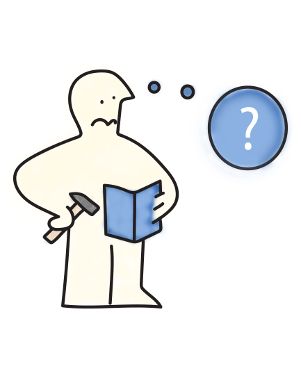
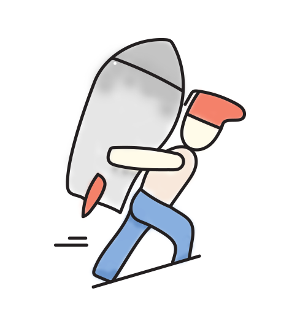
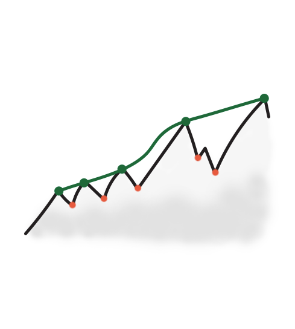

We, as humans, do a lot of illogical things. Moreover, they are easier to spot on other people than on ourselves. Psychology and behavioral economy call these illogical decisions cognitive biases. _ "Cognitive biases are systematic patterns of deviation from norm or rationality in judgment."_ \[1\] I chose 4 specific cognitive biases examples that are worth mentioning. Especially in design.

Cognitive biases are like fire. On the one hand, they can cause you some trouble. But on the other hand, if you know how to use them, they can serve you perfectly. I will mention 4 examples of cognitive biases, which can happen while designing the product. Within every one of them, I will give you ideas about when specific bias is problematic and tricks regarding how to lower its impact. Then, I will write some useful advice on how to leverage each bias to your advantage.

The reason I've decided to write a series of blog posts about biases is to better spot illogical decisions when they occur. Retrospectively said, during building products, I was several times trapped into some biases, and I hadn't recognized them. It could save me a lot of time, money and for sure, friends' nerves. But it is a different story.

## 1. The IKEA effect

> IKEA effect — the increase in valuation of self-made products

The IKEA effect was first demonstrated by Michael I. Norton, Daniel Mochon, and Dan Ariely in the publication "The IKEA Effect: When Labor Leads to Love" from Harvard University.

### What is the IKEA effect?

As they discovered, "in four studies in which consumers assembled IKEA boxes, folded origami, and built sets of Legos, they demonstrate and investigate boundary conditions for the IKEA effect—the increase in valuation of self-made products." This is important because it helped them discover that people value their creations more when they put in effort. They also found that when participants destroyed or didn't finish their creation, the IKEA effect wasn't present. In the end, they demonstrate that; "labor increases valuation for both do-it-yourselfers and novices." \[2\]

### How can the "IKEA effect" be problematic?

As Steven Cook mentioned in his blog; _ "the sunk cost fallacy is the idea that a team is more likely to continue a project if they have already invested significant time, money or effort into it, even if continuing the project is no longer the best decision."_ \[3\] The effective way how to lower the IKEA effect is to seek and listen for feedback as soon and often as possible.

### How can you use the IKEA effect for your advantage?

As Dan Ariely suggests; _" when we invest ourselves in something, we start liking that thing even more."_ He mentioned pretty easy examples to do, like ― let your users sign something, or give credit of doing something to them \[4\]. They will be willing to pay for the product more than others.

If you take early feedback, build on that, and send an update back. Suddenly, your user is involved, and the IKEA effect is serving you perfectly. Users have the feeling that they are part of building the product. This is my personal advice, which worked great for me several times.

Some restaurants are using this effect amazingly. In some of them, chefs prepare almost the whole dish, but you need to do the final touch. I've recently experienced this service, and I was amazed by how people reacted to the dishes, which they needed to finalize. The guests rated that as a great experience.

## 2. Effort justification

> "While you have to overcome some challenging tasks in building the product, be aware to not like what you have built just because it took your nerves. It can easily happen to developers who have to overcome technical problems." -

Effort justification is the type of cognitive bias when people make sacrifices to pursue a goal, their effort is often rationalized by valuing the goal more. _ "In other words, people sometimes come to love what they suffer to achieve."_ \[5\] This is quite connected to the IKEA effect, but this one is connected to the suffering aspect - whereas the IKEA effect is more general. Effort justification is part of cognitive dissonance theory, which I will be writing about in some of the next blog posts.

This dissonance, very common in different aspects of daily life, can lead us to make big mistakes.

As Francisco Ciel says; _ "A company director can continue with a strategy that is a disaster just because he has spent many hours developing it and putting it into practice."_ \[6\] Moreover, a company can invest in business models that are not viable anymore.

While you have to overcome some challenging tasks in building the product, be aware to not like what you've built just because it took your nerves. It can easily happen to developers who have to overcome technical problems.

### How you can leverage effort justification?

You can leverage effort justifications by letting people earn something - e.g., a membership. Prepare some tasks which your users need to do to join your group - it can be a VIP group or, for example, a beta user group. For example, I am currently interviewing the beta testers group of a project I am helping with, [Bannerium](https://www.bannerium.com).

If Google declines a candidate, the candidate can retake the interview after 1 year. If somebody was rejected 3 times, you could imagine how appreciative he/she will be about getting the job.

> "Endowment effect can be clearly seen with items that have an emotional or symbolic significance to the individual."

## 3. + 4. Endowment effect and Loss aversion

_ "The term emerged in the field of behavioral economics, where the empirical research of psychologists Richard Thaler, Daniel Kahneman, and Jack Knetsch has shown considerable differences between buying and selling prices of consumption goods, even when strategic considerations (for making a profit) are excluded. The effect is generally interpreted as a manifestation of the "loss-aversion" principle, which states that humans weigh losses more heavily than they do gains."_ \[7\]

Endowment effect can be easily understood as; we overrate things that we own. As Akhilesh Ganti mentioned in his article: _ "Endowment effect can be seen with items that have an emotional or symbolic significance to the individual."_ \[8\]

_The decision Lab summarized it; "Loss aversion in other words: it is better to not lose $5 than to find $5. It is a simple but powerful bias that is encapsulated in the expression "losses loom larger than gains" (Kahneman & Tversky, 1979) "_ \[9\]

### How the endowment effect and loss aversion can be problematic?

Imagine that you built a product. Now the feedback and data are showing you that you need to do change the strategy, potentially the product/feature from scratch. The problem is when you are in love with your solution and don't want to change it. But I have little trick which can help: use bigger perspective. Look on this particular thing as a small step in bigger vision. It means that this particular change is just necessary small step to achieve higher goal - building successful product. You will detach yourself from your solution and will do more rational step. I've learned this technique from the book: [Thinking fast and slow (by Daniel Kahneman)](https://amzn.to/38O2nx9). If you are into cognitive biases, I highly recommend this book.

_Be calm while the things are not going as planned (red dots). Be focused on achieving a higher goal -> building your product (bigger perspective)_

_"Insurance company websites will often display a long list of unlikely yet costly outcomes that we may encounter should we not buy insurance (Outreville, 1998)."_ \[9\]
I see huge loss aversion all the time when I have to cut some designs down. Moreover, if I put not trivial effort into designs, it is much harder to do. And it hurts. Emotionally hurts.

### How can you use endowment effect and loss aversion for your advantage?

Endowment and loss aversion is connected to free trials, discount coupons, or even company benefits. _ "The longer people spend interacting with these products, the greater the sense of ownership becomes."_ \[10\] You can combine this effect with the IKEA effect and give your users something after they'll do some activity.
I love the example, which Iris mentioned in the blog;_ "You can let people try some feature for some time, and then you can grab it back. You can see this principle used in League of Legends where Champion selection uses the Endowment Effect to convince players to pay to use a certain champion (character)._

_Every Monday, 10 out of 115 champions are released for free play. This means that players will be able to play these champions without having purchased them beforehand. When a player finds a champion he or she likes, it becomes difficult to give that champion up once that week is up, and the free champions rotate."_ \[11\]

## Summary

Cognitive biases are all around us, they can raise from a little bad decision to devastating strategy.

- As a first step, how to use them wisely is to spot them. As I mentioned in the beginning, it can be easier to spot them on others.
- As a next step, spot them on yourself. Afterward, you can use little tricks to lower their impact, which I mentioned in this article.
- As the final step is to use them wisely to improve your product. You can combine them and test them in various stages of your product.

I am going to write more about cognitive biases examples, so join our newsletter to get interesting, actionable insights weekly.

### Sources:

\[1\] Martie G. Haselton  Daniel Nettle Paul W. Andrews. University of California, Los Angeles, The evolution of cognitive bias: [http://www.sscnet.ucla.edu/comm/haselton/papers/downloads/handbookevpsych.pdf](http://www.sscnet.ucla.edu/comm/haselton/papers/downloads/handbookevpsych.pdf)

\[2\] - Michael I. Norton, Daniel Mochon and Dan Ariely. Harvard Business School. The IKEA Effect: When Labor Leads to Love: [https://www.hbs.edu/faculty/Pages/item.aspx?num=41121](https://www.hbs.edu/faculty/Pages/item.aspx?num=41121)

\[3\] - Steven Cook, LEVERAGING THE IKEA EFFECT TO CREATE HIGH-PERFORMANCE TEAMS:  [https://voltagead.com/leveraging-the-ikea-effect-to-create-high-performance-teams/](https://voltagead.com/leveraging-the-ikea-effect-to-create-high-performance-teams/)

\[4\] - Dan Ariely, How the 'IKEA effect' can motivate people to work harder: [https://www.youtube.com/watch?v=D5hD1uAg1N4](https://www.youtube.com/watch?v=D5hD1uAg1N4)

\[5\] - Effort Justification: [http://psychology.iresearchnet.com/social-psychology/attitudes/effort-justification/](http://psychology.iresearchnet.com/social-psychology/attitudes/effort-justification/)

\[6\] - Francisco Sáez. Effort Justification, a Common Form of Self-Deception: [https://facilethings.com/blog/en/effort-justification](https://facilethings.com/blog/en/effort-justification)

\[7\] - The Interaction Design Foundation: [https://www.interaction-design.org/literature/topics/endowment-effect](https://www.interaction-design.org/literature/topics/endowment-effect)

\[8\] - Akhilesh Ganti, Endowment Effect:  [https://www.investopedia.com/terms/e/endowment-effect.asp](https://www.investopedia.com/terms/e/endowment-effect.asp)

\[9\] - The Decision Lab, Why is the pain of losing felt twice as powerfully compared to equivalent gains?  [https://thedecisionlab.com/biases/loss-aversion/](https://thedecisionlab.com/biases/loss-aversion/)

\[10\] - Aaron Brooks. Venture Harbour. The Endowment Effect: 7 Ways to Use It to Boost Your Conversions (with Examples): [https://www.ventureharbour.com/the-endowment-effect-7-ways-to-use-it-to-boost-your-conversions-with-examples/](https://www.ventureharbour.com/the-endowment-effect-7-ways-to-use-it-to-boost-your-conversions-with-examples/)

\[11\] - Iris. Medium.com. Bias & Design: The Endowment Effect: [https://medium.com/@iriskuo/the-endowment-effect-on-design-33c877e5ea66](https://medium.com/@iriskuo/the-endowment-effect-on-design-33c877e5ea66)
