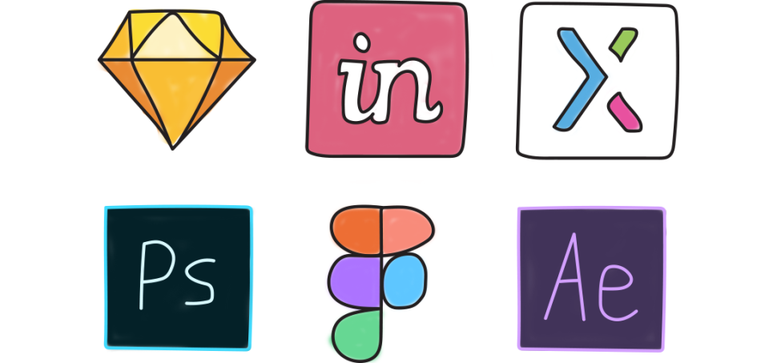
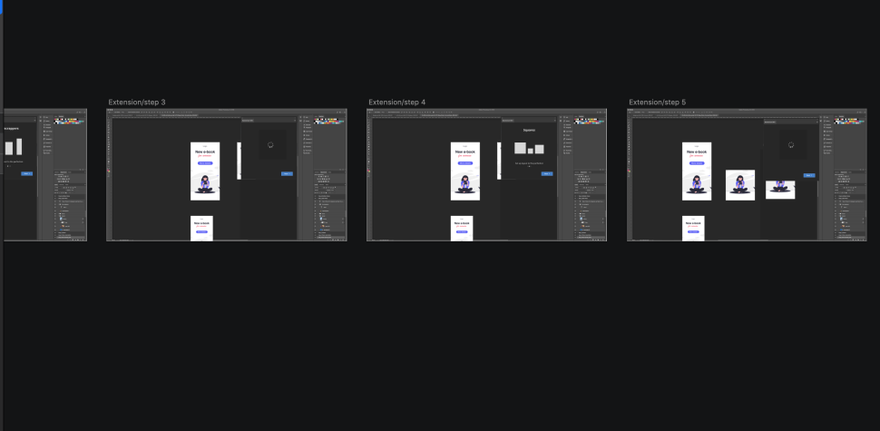
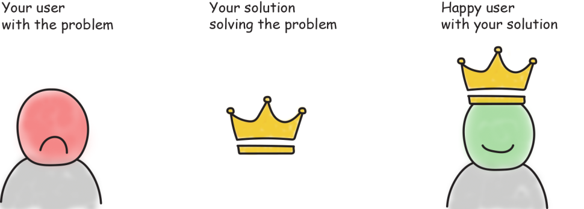
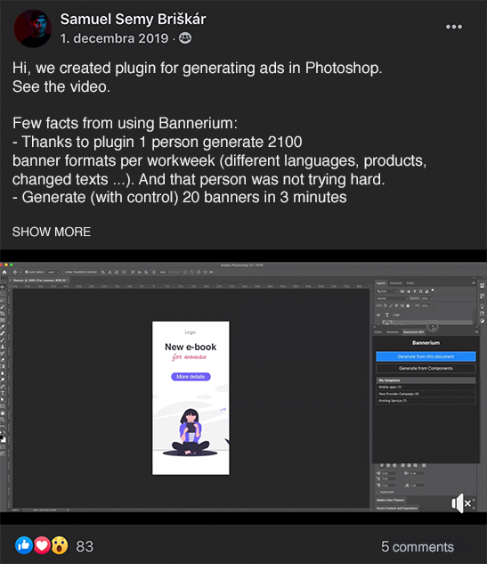

In this blog post, I would like to show you a practical example of a “fake it till you make it” approach to product development. To my mind, it basically means that you are trying to stay a few steps ahead of your current situation. You are “faking” the idea that you have progressed more, but you actually haven’t. This approach gave me invaluable answers for my product which were hard to get otherwise.

## Here is my story:

3 years ago, my former manager came to me and told me to do around 1500 banner ads. The company I worked for got new products and they wanted to market them in different countries. We got 6 products in 5 colors and the aim was to create ad banners for 3 countries. The goal was to create 15 formats of each banner ad. It was a nightmare for the graphic department. And I was its team leader.

When I imagined myself doing 1500 banner ads, I wanted to cry. This scenario of creating thousands of banners could happen easily every month. It is possible to do manually 1500 ad banners, but it is just… too boring! I wanted to be a creator, not a generator.

I started immediately googling how I can automate the process of creating banners sets. I found some solutions but they were pretty useless. They weren’t flexible enough.

I decided to create my own solution. I experimented with Photoshop, more specifically with the “Actions” feature there. Basically, the Actions feature was recording my steps in Photoshop. So, I could record how I manually generated banners, then play it again and generate the banners. It was pretty simple: Yet powerful. With this script I created, I was able to automate some parts of the process and help our department to be faster.

I was interested in a community of graphic designers who had the same problem. With my friend [Ivan](https://twitter.com/iChangeTheWay), I created a landing page in a few hours. [Tomas](https://twitter.com/tmvst) sketched the logo in 5 minutes, then we came up with pricing. I created a video of the script and…

I posted it to a local Facebook designers’ community group.

And this is what happened:

_My post to a local Facebook designers’ community group._

I was amazed by how many people had the same problem as us. What was more amazing was that 5 people bought the script. It wasn’t cheap, it cost around 110€. Looking back retrospectively, I think it was… a miracle. It showed me that the problem was there and people were willing to pay for the solution.

At that time I didn’t know anything about building a product, selling, consumer behavior, or SaaS (Software as a Service). Well, I knew the theory, but just from videos, friends, or lectures. But I didn’t have any tangible experience.

## I started with experimentation.

I created **a free version of a Photoshop ad generator as a Freemium model,** which could automate only 6 banner formats in contrast to the full version which could automate 20 formats. I gave it for free to people in exchange for getting feedback from them.

To be honest…

0 people bought the full version after they tried the free version.

Frankly put, it failed. I was overly optimistic and thought that the product would do better. On the other hand, It motivated me to ask people what was not working for them and how I could get better. I even gave the full professional freelancers version, which cost 110€, for free in exchange for feedback.

And what happened?

**Nobody wrote me back.**

It sucked. I didn’t know what to do next.

At that time I let it go. I didn’t have money to build the product and I didn’t feel that I had enough experience to build the software from scratch.

## After more than a year break

After a year and a half, I decided to explore this topic again. I learned new things from Product Management, User Experience design, I was closer to friends who were dealing with product development on a daily basis. So I gave it a try.

The last script didn’t work for all graphics of banners, it worked only for a few specific graphics. It was good, but once you wanted to generate some complicated banner, this script did not work smoothly. Meanwhile, Photoshop developed a few other features, which changed the game. My game.

## Little technical context

Scripts are technically the easiest to do however, they are quite limited. I decided to learn more about what was feasible in Photoshop. I’d learned about plugins, which seemed like the right way to do things. However, to do a plugin, I needed a front end developer, because I couldn’t code on a sufficient level.

The problem is that building something with a developer is the most expensive thing to do. And I didn’t even know if people were still interested in the solution. The only thing I knew was that I wanted to improve generating ad banners as much as I could, but how it should work? I had no clue.

## Just do it!

But I had something that I believed was powerful. Designer superpower. Really, Sam? Superpower?… Yes, superpower. Let me explain.

If I want to get rid of generating, what should I do? I could  just hit some magic button and everything would be set. But how would it work? It's time for 🥁 designer superpower, (which I believe is a designers’ toolset).

_Designer superpower - designers&#39; toolset_

I realized that I could “fake” the whole plugin and interactions in it. The reason for faking the plugin was that I needed to see if people were still interested in my solution.

I knew that the demo of the plugin would serve me as a great tool for explaining graphic designers the power of that extension and could give developers a vision of what to build.

## So I started:

I created basic wireframes of Photoshop plugin in Sketch.

_Preparation for video._

Then I needed somehow to fake the algorithm of generating banners. So I recorded screen videos and I got rid of some parts. I removed these parts where I needed to manually re-organize components in banners. In the end, these screen recordings looked like a great generating algorithm.

Now the final part. I needed to connect these parts. For this purpose I used Adobe After Effects.

And this is the final video which took me 2 weeks to do:

[https://youtu.be/JWApMjQ3-jE](https://youtu.be/JWApMjQ3-jE)

I showed this video to friends of mine and they thought that I had learned how to code. At that point, I knew I had done it well.

**🗒Side note:** When you think of that, this is a superpower. With some tools, you can show people (in my case graphic designers) the future them and spark imagination. You can take some ideas and make them look real. Suddenly, all the people can see how your product should behave and what it should do. Isn’t that powerful?

_Ultiimate goal of your product is to solve user&#39;s problem_

After the video was complete, I created a landing page and posted the plugin into local facebook design/marketing communities

_Facebook post with video which gave me 400 signups_

I added my [landing page](https://www.bannerium.com/) in the post, then I shared it to other groups/forums and I got 400 signups.

I even got some deal with a design agency, which told me that they would give us some money to develop a plugin. Moreover, I even had 2 meetings with them. Just based on the video.

In the end, nothing came from this deal. That was reasonable. Here is why: The truth was, that I had just released the video. I didn’t have anything else. Just some parts connected with duct tape. At that time, I had no clue how close we could get with the real code.

**💡Lesson learned**

Showing a “fake” video is powerful for sharing a vision and testing if there is a need for a solution. On the other hand, if the video is too ambitious, people will take it as a norm and will base their expectations on the video. If the real product doesn’t match the video afterward, they will probably be unsatisfied because the product is incomplete. This thing happened to me when I had a call with a user during beta testing. She expected that the complete product should work as it was on the video. So sometimes it is better to be realistic. Otherwise, you will create unhappy initial users. But I believe it is a trade-off and you need to count on that.

Once I saw that the product was still in demand I found a programmer called Petr and we started with the development of the plugin. The video was also a great tool for how to communicate what I wanted to achieve. Of course, video showed happy path and I needed to design “what if” scenarios, afterwards. But it served my expectations perfectly.

Then we went through beta testing, which 50 people joined. Nowadays the [product is live. ](https://bannerium.com/)

## Summary:

### A Designer toolset is a superpower. You can easily create something that was not on the market before and validate your idea. Just in a week.

- Creating a video is a powerful tool but if it is too ambitious, you will create unhappy first users.
- Count on the trade-off that some people will think that product is actually working, but are unsure. I suggest you create beta testers out of them. It can bring you value afterward, [as I wrote in my previous article.](https://www.lunadio.com/blog/4-cognitive-bias-examples-you-should-be-aware-of-as-a-designer)

After this example, I would use a fake demo of the product more sensitively. I still believe it can save you a lot of money, help you validate your idea and get you traction in your idea.

I hope this example will show designers how powerful they are. Furthermore, it will show non-designers what they can achieve with designers onboard.

If you are interested in my future content about building products through designer eyes, feel free to join the newsletter below.
