I try to improve myself every day. I did long-term experiment (at least long-term from my point of view). At that time I didn’t know anything about theories like [kaizen](https://en.wikipedia.org/wiki/Kaizen), the [theory of continuous improvement](https://www.researchgate.net/publication/318097932_Towards_a_Theory_of_Continuous_Improvement), or some deep theory on how to [build a habit](https://amzn.to/2yHNpMY). I just wanted to improve. And I wanted to start immediately.

Let me tell you my story and share my personal experience with you. I believe it can show you the power of routine.

## What did motivate me?

I truly admire people who can draw. Beautiful pictures showing an artist’s imagination. There is simply no limit on what can be drawn. I wanted to learn this super-power, too.

Sometimes my imagination can provide a pretty clear image in my head and I just need to reproduce it on paper. Easy right?

So I began.

_Picture of my girlfriend with a gun in her hand_

Eh…

Why are you laughing?

Well, I know why. It was horrible. It truly was. It was so bad that it was funny at the same time. I thought that I could replicate the image which I had in my head, but obviously…

I could not.

I doubted whether it was even possible to improve when I was that horrible?

I challenged myself!

I wanted to learn how to draw. Because I knew that I could not learn how to draw in my 25 years, I needed to change the strategy. I also knew that it was impossible to learn to draw in days. I knew it would be a marathon and I needed to keep going.

**I created some simple rules to help me with my motivation.**

1.  It has to be an enjoyable experience.
2.  Draw every day, at least for 5 minutes. It can be anything, I just need to keep practicing. **BUT** - draw every single day.

### **Beginning of drawing challenge**

Beginnings are hard. Everybody is saying that. I had a clear vision of the drawings in my head. I saw a lot of great work on the internet. I even asked Vladimir Strejcek (founder of illustration studio - [Drawetc](http://www.drawetc.com/2019/)) for help and he told me: “Draw whatever you can and as much as you can.”

**🗒Side Note:** We hadn’t known each other before, but it seems people are nice if somebody needs genuine help.

**So I was practicing, practicing, practicing.**

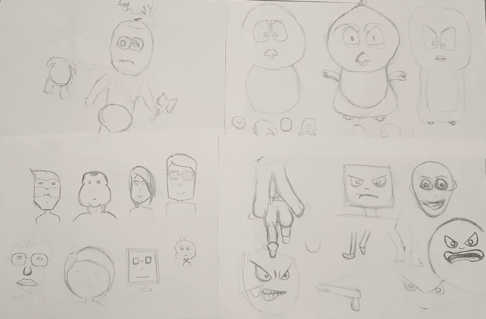
_First month of drawing challenge_

As you can see, I drew anything that caught my attention. Sometimes I drew more things on one paper and sometimes I tried something bigger. From time to time I tried to follow some artwork and another time I even tried to draw things by heart.

After 3 months, I sat down and I was drawing for about 2 hours. Me, pencil (rubber of course) and paper. And this is what I was able to do at that time.

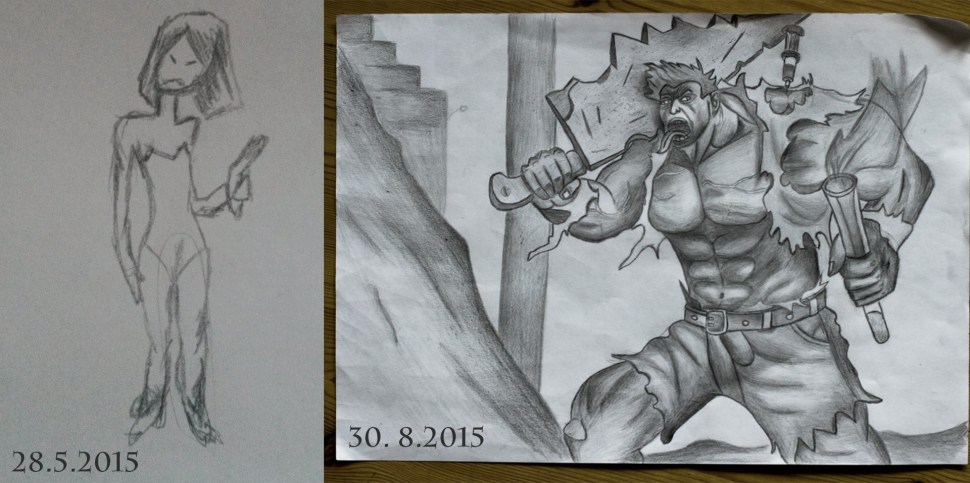
_Picture after 3 months in drawing challenge_

**🗒Side Note:** I started at the bottom and then it is easier to do the progress. But when you compare it to others, it was still bad.

**💡 Lesson learned**

In the beginning, I didn’t know exactly how to name the issues in my drawings. I just could see that it was bad. It was like some foggy big ugly thing. But I lacked understanding the reasons why it was bad.

However, once I got better and better, I could name the exact problem and pointed where my skill was lacking. It means that by practicing I could name the  issues in higher detail and I could improve my overall skill. With this knowledge in my head, I knew what I needed to improve.

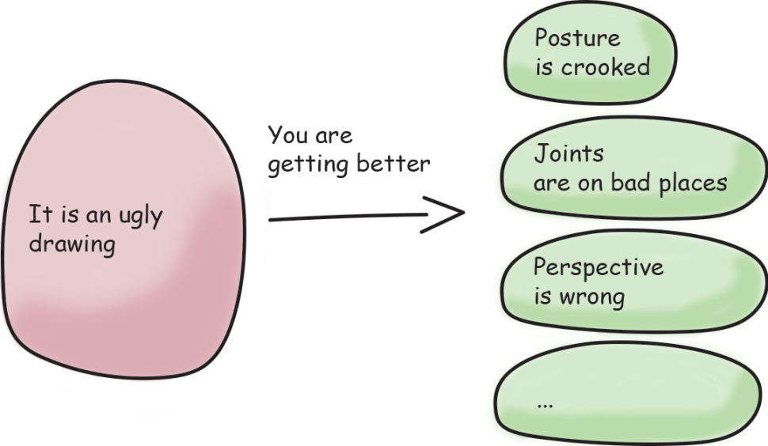
_Once I got better I could name the problems in detail_

For me, it was parts like mouth, nose, hands, etc. So I decided to draw only these parts of the body for some time.

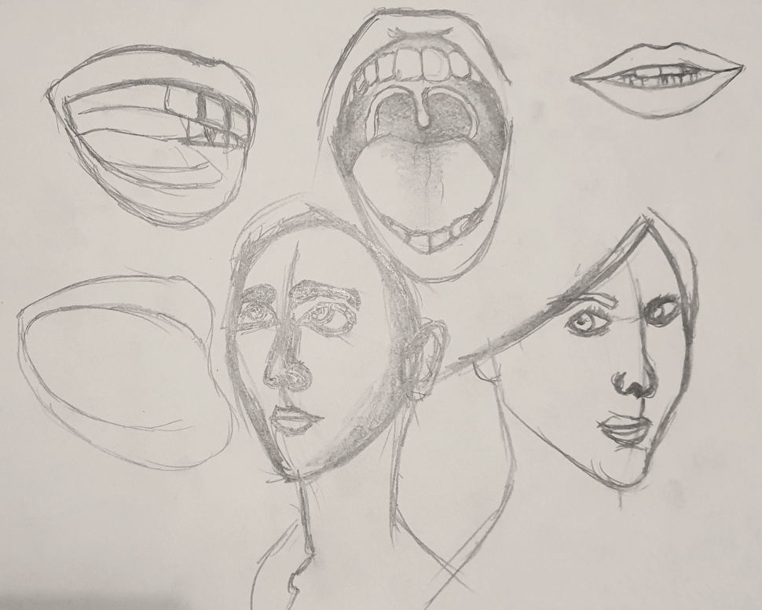
_I was focusing on the head_

### **Continuous improvement process**

Once I was getting confident in the process and in my drawing skill, the things that I learned started to fade. The reality is that on the learning curve I didn’t move so fast as in previous months. Which was discouraging.

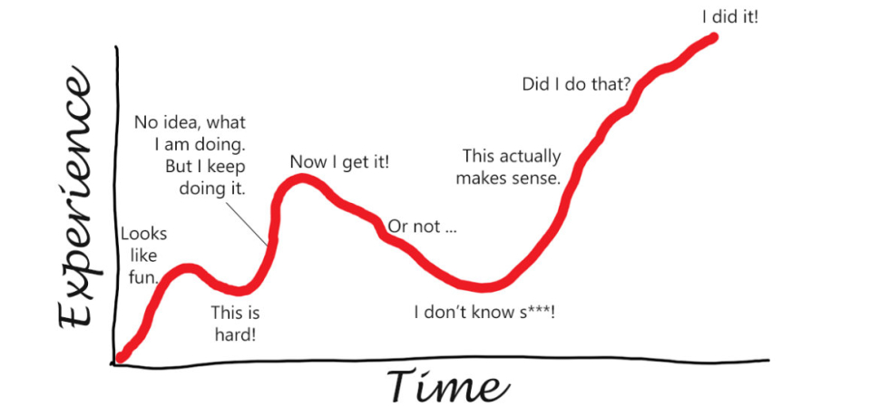
_Learning curve of every drawing_

But on the other hand, with my confidence, I could try to draw with a black pen as a new technique.

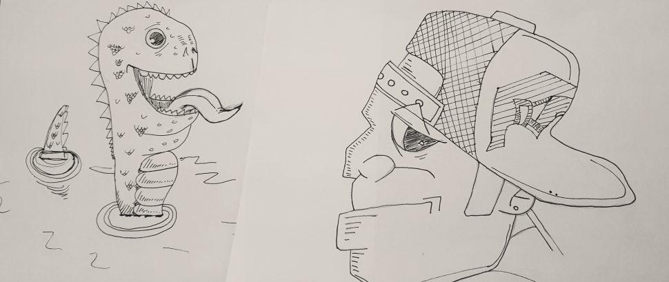
_Experiments with line drawing_

Moreover, I was confident enough to draw my girlfriend again. In this step, I was quite lucky that I met an illustrator who was more skilled in drawing than me. He helped me to point out the small details which were off.

What helped me a lot with my motivation was that I could see the track of my journey (I had pictures with dates on them). I saw details in which I had improved and that gave me quite a lot of motivation to continue.

### **Drawing my girlfriend after 4 months.**

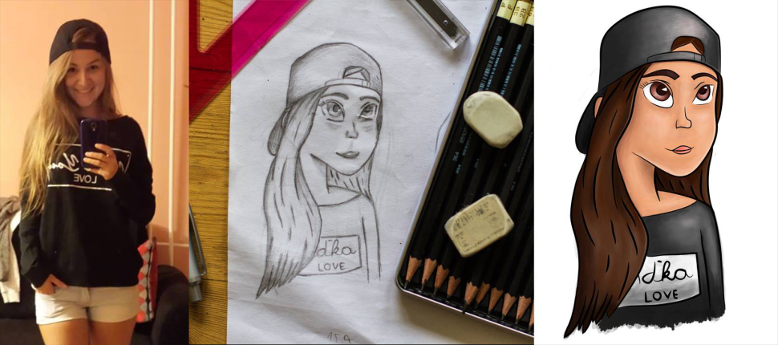
_Second drawing of my girlfriend._

**💡Lesson learned**

A teacher or buddy is somebody who can boost your skill by pointing out the exact imperfections. This advice gave me the opportunity to grow. The buddy or teacher doesn’t have to be a master in the skill you want to learn. Sometimes a master’s skills are too far away from yours and it is harder for them to explain to you, which mistakes you are making. And even sometimes, it can be discouraging, because they will see tons of ways how you can improve and some of them are not afraid to point them all at once. The improvement list can be long and that is okay. You are learning. But remember the teacher or buddy has to be better than you are.

After 5 months I wanted to replicate works I admired on the internet. The tricky thing here is that I was comparing myself with masters. Of course, I was not there, but this is what I wanted to try.

### **This was after 5 months of drawing**

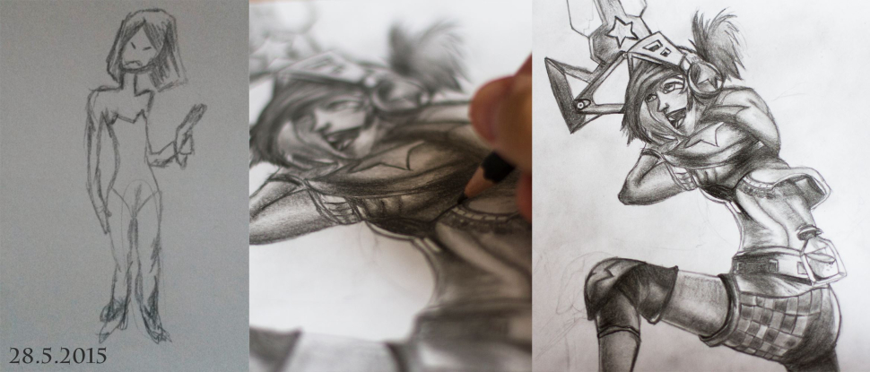
_Drawing after 5 months_

### **And this was the drawing after 6 months**

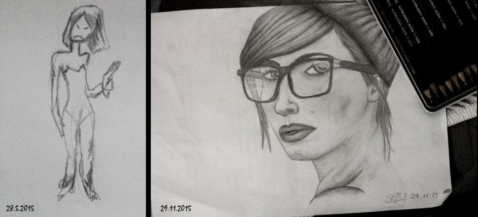
_Drawing after 6 months_

The funny thing is that after 7 months I got a commission from my friend to draw pictures for the web. I’ve never done that. So I tried:

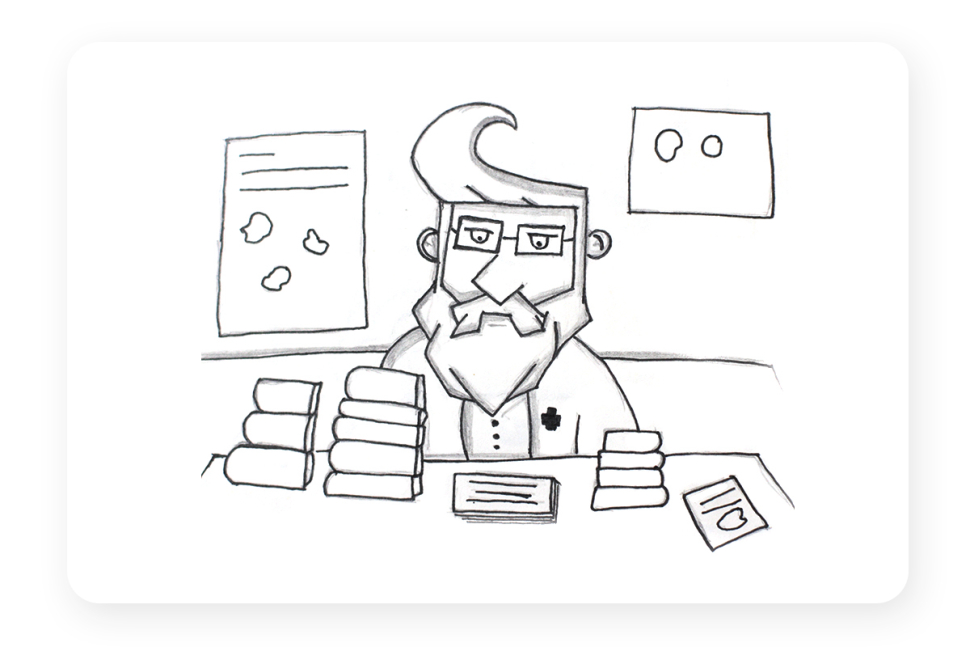
_Drawing of doctor_

_Picture of doctor_

And I got other commissions to draw even logos:

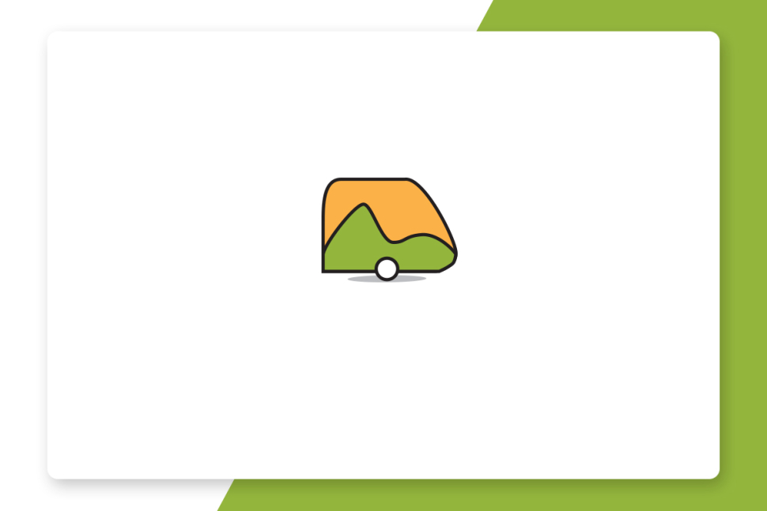
_Logo for caravan shop_

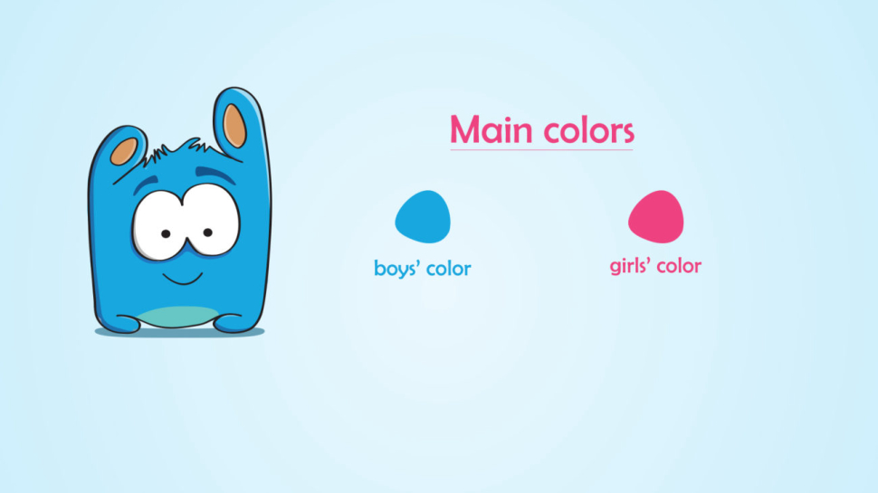
_Logo for kindergarden_

After 7 months I stopped with the daily routine because I had achieved the goal I had and I wanted to focus on my master’s thesis. I didn’t want to be a professional illustrator, but I wanted to know some basics. If I now need to sketch something, I am able to do it.

At the same time, I was amazed by where continuous improvement and some simple rules could bring me.

### Summary

- The most important thing is to practice.
- Patience is the king. Don’t want to jump. It is better to start slowly and walk.
- Keeping going is key. While I was drawing, I remember running from a party because I forgot to draw.
- Once you lose your routine, start it again as soon as you can. Start with something easier, don’t resume your routine where you ended, but lower the number of reps.
- Following a routine every single day is hard. For sure you will fight with your emotions. In these bad times just make it funnier for you. Try something new, remind yourself of your improvements and also the reasons why you started or check for inspiration on the internet. These little crises will for sure come. Don’t make a big deal out of them.
- Today I know that there are plenty of books and articles which can be helpful in building a habit ([James Clear is writing amazingly about habits](https://jamesclear.com/habits) see the [Atomic Habit](https://amzn.to/2yHNpMY)). But, be aware of [imposter syndrome](https://www.psychologytoday.com/intl/basics/imposter-syndrome) and don’t over complicate your practice. It is totally OK to be bad, there is nothing wrong with that. You are a learner and failing is vital.
- While doing a routine, focus just on the next step. Far off goals are too distant and it can be discouraging to compare yourself every day with your future you or skilled masters. Be patient.
- One little trick is to put events in the calendar for days and exact times when you want to do the routine. If you manage to do the routine, you can delete it.

I hope this story can be inspirational for some people who want to start doing something but actually haven’t even started or got stuck. Do you want to learn how to draw, play a violin, learn how to code, build a product or even sing? Just do it. And try to improve every time you attempt to do it.
