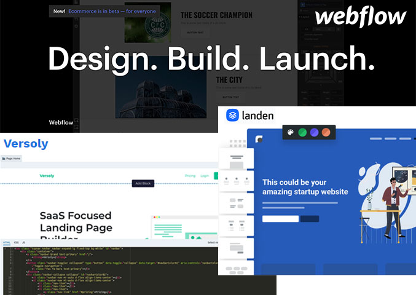
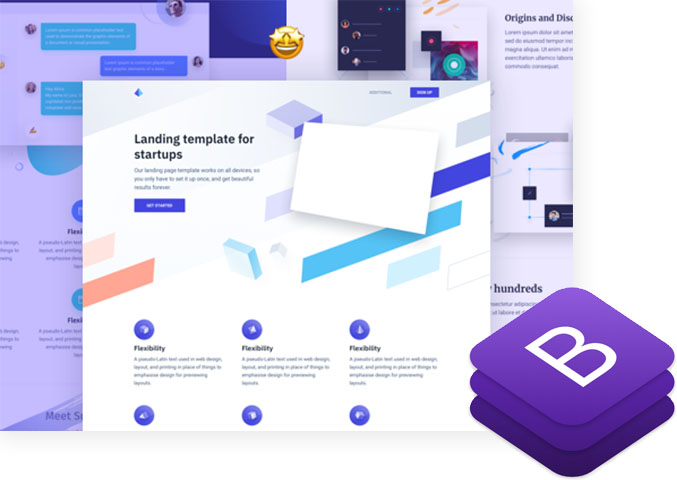

Hello, startup people! My "idea to launch" blog series continues with the next article. In the first blog, I presented you a way [how you can come up with a million-dollar idea](https://www.lunadio.com/blog/how-to-come-up-with-a-million-dollar-startup-idea). Then I showed you some [great examples of idea validation](https://www.lunadio.com/blog/validate-your-idea-with-pocket-money). Today we will look at landing page template options we have to create a perfect website for your product or service.

I did some research and looked for options we have to create a perfect landing page. Also, I asked people like you (startup founders, indie hackers, product builders...) what their favorite tool or way to create a landing page is. You will find the results below.

## Are you looking for a "code" or "no-code" solution?

The first question you need to ask yourself is if you can (want to) code or not. There are tons of options out there, and you don't need to be a webmaster if you want to create a remarkable landing page. Anyway, webmasters are cool 😎

_Webmaster &#34;on fire&#34;_

I will split these options on **"code"** and **"no-code"** options (which is kind of a buzzword these days).

_Let me say first, none of the mentioned tools/services is paying me for this (however, they can send some pocket money if they want_ 😜*)*

## Best no-code tools for landing page

As I mentioned, I did quick research before starting to write this blog. I was curious about what is the number one option for startup founders to create a landing page with. I Googled a little bit and asked fellow [Indie Hackers](https://www.indiehackers.com/post/best-no-code-options-for-landing-page-a3c10ca5f0). Here are the results.

_Webflow, Landen and Versoly website builders_

### If the design matters think about [Webflow](https://webflow.com/)

One of the most popular options for creating no-code landing pages is Webflow. They offer numerous website templates you can later customize. Or you can use their drag & drop builder for designing a webpage totally by yourself.

I was surprised, in a good way, how fast their websites actually are. I used this kind of web builders a few years ago, and I remember it took ages to load a website like that. Not anymore.

The other thing I love about Webflow is their animations. This tool is really amazing; you can set up animations without knowing the code. It's easy to create and preview these animations, and I see they really put a lot of effort into this feature.

Btw if you find Webflow not suitable, you might check [Squarespace](https://www.squarespace.com/), [Wix](https://www.wix.com/) or [Webnode.](https://www.webnode.com/)

One more platform I need to mention is [WordPress](https://wordpress.com/). [One third of all websites run on Wordpress](https://w3techs.com/technologies/overview/content_management). Crazy number. WordPress is an open-source content management system (CMS), and it’s here since 2003. There are tons on WordPress templates on the Internet, and you will find hundreds of them for landing pages too. WordPress offers a blog and many plugins that might help you tune-up your website.

**Advantages:**

- beautiful design of website templates
- nice animations
- loading seems to be fast (not sure about WordPress)

**Disadvantages:**

- might be too complicated for beginners
- maybe overkill for a simple one-page landing page

### Simplicity for the win

Honestly, you don’t need much to validate your idea. You just need a simple website and show the world what you are building. For this purpose exists website builders that focus on simplicity over functionality. You don’t find a website animations there or hundreds of templates, but it does the job perfectly.

#### [Landen](https://www.landen.co/) - The website builder made for startups

You might check Landen, which says is “The Website Builder made for Startups”. And I agree. It is focused on startups, validation, and early adopters. **I love their onboarding process**, where you are just simply filling out the well-designed form and creating a new website. They prepared everything you need as a startup founder validating your idea. They got integrated email list, simple analytics, blog.

#### [Carrd](https://carrd.co/) - Simple one-page sites builder

Even simpler landing page builder is Carrd, which seems to be a good solution for your online business card as well. They offer **free templates for simple websites**, and you can find some more good looking examples on [Drrac](https://drrac.co/), too.

#### [Versoly](https://versoly.com/) - SaaS focused website builder

One more website creator I need to mention is Versoly. They also focus on startups, especially SaaS companies, which I believe is a very good niche market. Their builder is based on blocks like header, clients, pricing, call to action, footer. It’s easy to compose your landing page by just selecting blocks you wish to have. Recently, they added a blog that I find important. The other thing I find interesting is a **built-in code editor**. You can edit the code directly, which might be useful if you want to customize something, and you know how to code. The code editor is great, and it looks like Sublime, which you might know already.

**Advantages:**

- they focus on early startups, idea validation and you can benefit from it
- prepared components and elements
- very simple and fast website building experience, it really takes only minutes to create a new website

**Disadvantages:**

- you can’t run e-commerce site on the website, they don’t have any payment gateway integrations
- I wish they open their platforms so other people could create web templates and selling them or offering for free

##

**Best HTML landing page options**

You read this if you "can code", which means you know HTML+CSS, and you are able to copy & paste code from StackOverflow.

_Cruip and Bootstrap landing page templates_

### HTML landing page templates from [Cruip](https://cruip.com/)

I love their work. They are doing a great job of creating a beautiful landing page templates. Templates are intended for products and services, and their design is stunning. I use their templates for my projects too. There are all components you need to have on your landing page, like pricing, features, sign up forms, and so on. It's very easy to customize it and combine elements. Also, they created a [collection of top landing pages](https://saaslandingpage.com/), so you can get inspiration there.

**Advantages:**

- excellent code quality
- well organized code blocks
- you can combine components across templates
- mobile-friendly
- amazing design

**Disadvantages:**

- some templates are paid...not really disadvantage, but I need to come up with something 😅

### Bootstrap templates

It might seem to be deprecated for some 2020 front-end senior expert developer, but it does the job. There is a ton of free bootstrap landing page templates out there, and it's easy to find them. I'm not going to pick some templates for you, but you just need to [Google it](https://www.google.com/search?q=bootstrap+templates).

**Advantages:**

- A lot free bootstrap landing page templates on the Internet ready for you
- If you know bootstrap, it's easy for you to customize it or add new elements
- mobile-friendly...as least it should be, don't forget to check the template on mobile

**Disadvantages:**

- there are so many templates it's hard to find some suitable
- I wish there is some good source of hand-picked top bootstrap landing page templates (let me know if you know any)

### Creating a webpage from scratch

Designing and coding the whole landing page by yourself is still an option. Personally, I wouldn't recommend it if you are just starting out and you want to validate your idea. In this case, you should go with some pre-made website and don't waste time.

However, if you think your idea is validated and you want to move on, I suggest creating a new landing page by yourself.

**Advantages:**

- 100% flexibility, only limitations are your design and coding skills 😉
- lightweight website, no unused code, and libraries
- you own your code

**Disadvantages:**

- it takes a lot of time
- you need to be a solid designer as well as webmaster

## Quick summary

Think about what is your goal with the landing page. If you want to validate your business idea, go for a simple one-page website. Focus on content and idea presentation and get emails from early adopters.

If you need something more complex, consider building a website from scratch using some of the mentioned CMS.

By now, you might know some of the best landing page templates options. However, the design and functionality are not so important as the content is.

**You don't want to miss my next blog post.** I'll show you how to create content on your landing page and increase conversions. Subscribe below!
