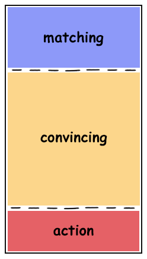
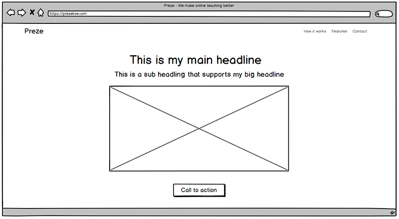
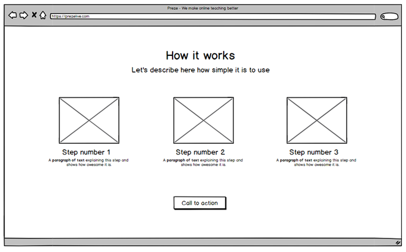
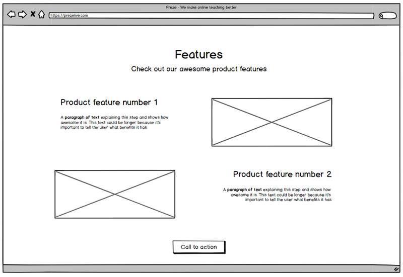
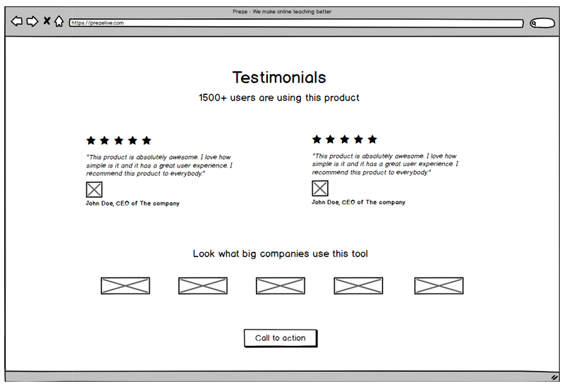
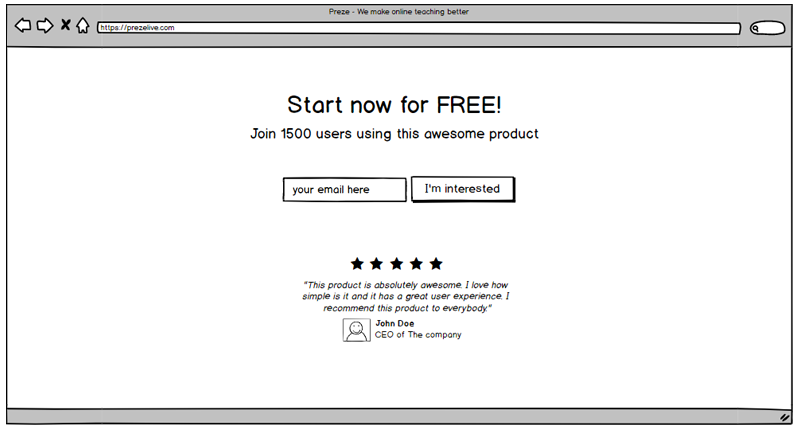

If you're [creating a landing page](https://www.lunadio.com/blog/best-landing-page-template-options) for a project or you want to optimize the current one, I have a few ideas for you. I will show you the example structure of the landing page that converts and I add some advice.

Every good landing page should have set the main goal for conversions. It depends on you what conversion means for you. Whether it will be gathering email addresses or sign-ups or buying your product, you should set the one main goal.

## Ideal structure of landing page

**Matching.** In the first part of the website (the visible part without scrolling), you need to present a reason why a visitor should care and scroll below. This part of the website is called “matching”. You need to match your target audience with the right words, so they will start scrolling the page.

**Convincing.** The rest of the website is about convincing your visitor. Why should he use or buy your product? What benefits it has for him?

**Action.** Define one action you want from your visitor to do. Buy, subscribe, sign up, etc. Don't combine multiple calls to action. Focus on one.

## Matching

The first impression is very important not only on a date but also on your landing page. You have to use the right content (words, images, videos) to catch your visitor's attention.

Each visitor is asking this question when they came to your website:

**What is this page about?**

If the answer is satisfying for them they continue scrolling below. If not they leave straight away. You have to match your visitor from your target group with an eye-catching headline and content that raises his interest. You should come up with a clear headline that presents your project and it should be less than 6 words. Check [this article](https://marketingexamples.com/copywriting/landing-page-title) for some ideas on how to write a landing page headline.

The other thing that helps match your visitor is a visual element. An image or a video. It helps the visitor create an idea of what the product is about.

**💡Pro tip:** _Don’t overthink it. Make it clear and as simple as possible._

## Convincing

Hopefully, the visitor reaches this part of the website. Now, they are asking questions like:

- What is your product about? How it works?
- Why should I care? How it helps me?
- Can I believe you?

**Let’s take a closer look at each of these questions.**

### What is your product about? How it works?

I like to answer this question in simple steps so the user knows what is the process and how it works in practice. You can support each step with the image or preview from your product and add a small description.

**💡Pro tip:** _Present how it works in 3 steps. it’s a magic number. (e.g. 1. upload a file, 2. optimize the file, 3. download updated file)_

## Why should I care? How it helps me?

In this section, focus on the benefits of your product. List all important features your product has. Add images from your system that show the functionality. It has to be clear. Highlight only that one feature. Don’t use big screenshots that are hard to understand for someone who doesn’t know your tool. Describe how this specific feature helps the user.

Don’t forget to add a call to action button because in this stage a visitor might be convinced and ready to do the action you want him to do.

**💡Pro tip:** _Combine the product features with benefits that have for your users. For example, you can say “Save your time (with this feature)” or “Increase conversions (using this feature)”._

## Can I believe you?

Social proof is very important in the [decision making process](https://www.lunadio.com/blog/what-facts-can-cause-designers-irrational-decision-making). Show visitors that other users are using your product, and they like it. Reviews and testimonials are the best way to gain your visitors' trust. The best you can get is if the product is using someone they know from the industry.

Numbers help too. Show how many users you have, how often they use your product or what rating do you have.

Add company logos if you know someone from the known company using your product or service.

\*\*

**💡Pro tip:** _If you use only one or two logos of known companies, other logos will look important as well._

## Call to action

This part of the website is about converting. You either convert or lose the visitor. Set one main call to action you want your visitor to do. Don’t combine multiple calls to action. The main one should stand out and the user shouldn’t be bothered with other links and calls to action.

If you ask for an email use input + button. Not just the button that opens a modal window or redirects visitors on a registration page. This will increase the conversion rate in the next step (e.g. registration).

**💡Pro tip:** _Add a number. Show how big your community of users is. The visitor will want to join and be a part of it._

## Other important factors

### Call to action vs Call to value

Think about when it is good to use a _call to action_ and when is better to use a _call to value_. If your visitor is not convinced because he has seen not enough information yet, you should use the call to value. For example in the header use “How it works” (_call to value_) that scrolls below instead of “Buy now” (_call to action_).

### Loading speed

Nobody likes to wait for a page to load on the Internet. And Google doesn't like it either. So, you should [check your website loading speed](https://developers.google.com/speed/pagespeed/insights/) and optimize it.

### Mobile optimization

Don’t forget to check and optimize your landing page for mobile devices. 50% of visitors come from mobile and the landing page should have the same structure and show the same value.

## Conclusion

As I said, the landing page is about conversions. Don’t be satisfied with what you have at the moment. Want more. **Track data,** [**gather feedback**](https://www.lunadio.com/blog/efficient-feedback-management-as-a-growth-tactic)**, do A/B testing and optimize for conversions.**

I updated my [landing page](https://preze.live/) recently as I pivoted my idea towards online teaching. Feedback is welcomed.
