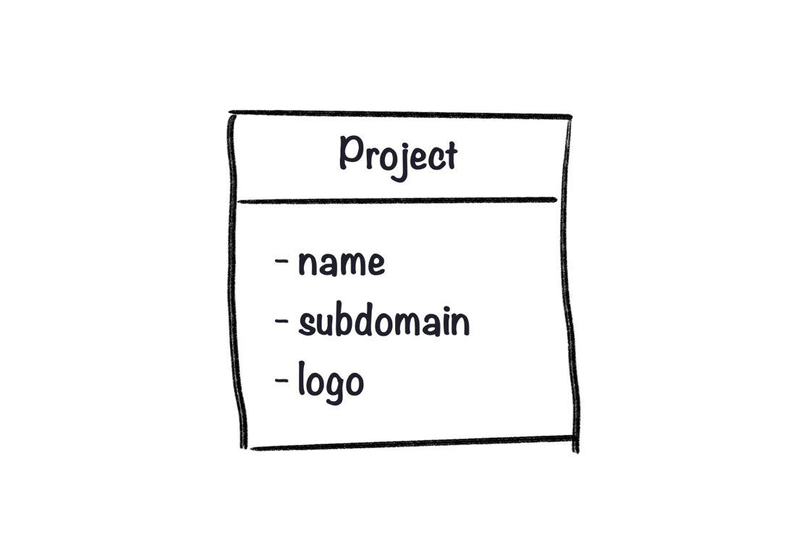
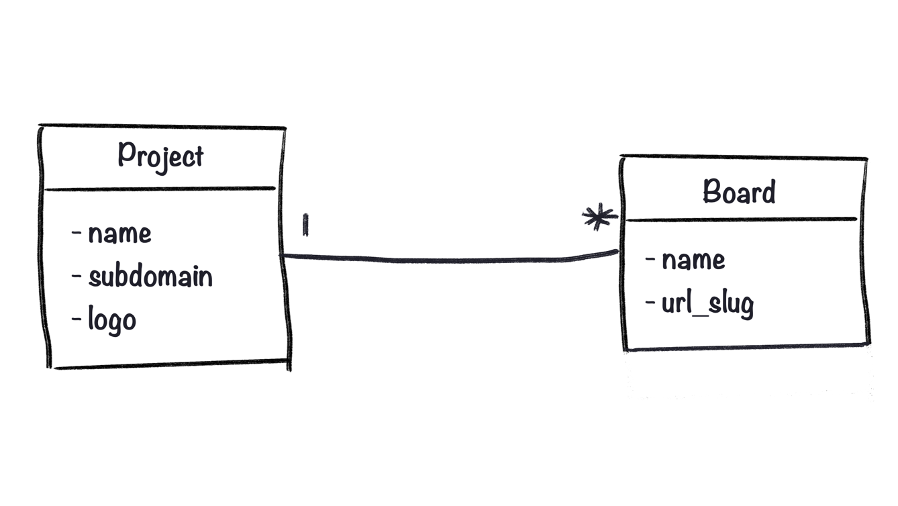

I read many articles trying to cover the topic of technical design patterns, but they’re mostly just describing a giant tech stack. That’s not helpful for people that want to **start a business**. If your priority is to solve a real problem as fast as possible and make money, you don’t want to spend time setting up container orchestration!

Let’s say you have [created the landing page](https://www.lunadio.com/blog/guide-to-a-perfect-landing-page-content) for your idea and collected a bunch of emails. Now people are waiting for the actual solution – time to build! Generally, your goals are:

1. **Fantastic user experience** – To make your users happy
2. **Building as little as possible** – To be able to move fast
3. **Fast development** – So you can focus on marketing too
4. **System resiliency** – To be able to catch and fix errors easily
5. **Easy for a solo developer** – You don’t have team, make it an advantage

With those in mind, let’s create something, shall we?

This article is a part of a series about technical design patterns for building a SaaS project. Today, I’ll cover why you should start with the data first and how it will help you down the road. Future parts will be focused on frontend, backend, hosting, CDNs, email delivery and everything you need to build a **great product, quickly**.

### Keep in mind: Always pick a technology you’re most familiar with

This is not the time to finally learn React, or use GraphQL for the first time. If you’re a developer, chances are, you already have a solid foundation in something.

If you don’t have a dev background, try to first build your MVP using no-code tools. Learning to code from scratch can be slow and frustrating, making you more likely to abandon your business. This article will help you start whether you choose to use code or not.

When starting FeedBear, I’ve already worked with Rails before, so that’s what I picked. However, the patterns I will be talking about apply to almost any tech stack. Technical design is mostly about a **general approach and thinking**, not a concrete piece of code.

## Part 1 – Bring order to the complexity

You may be tempted to start drawing the interface or jump straight into the console with a “new project” command if you’re confident about a solution. Most of the time, it’s too early.

Business problems are inherently complex. Whatever you’re solving, it has the tendency to become a mess once you think about all the use cases and options.

Solution: **Figure out the functional requirements and the data model first**.

- What core use-cases is your product addressing?
- What kind of data are you working with?
- How will the data interact?

Having answers to these questions before you jump to code allows you to create with confidence and speed later on. Also, it’s impossible to make an intuitive UI without making sense of the data first. Your goal is to create an MVP – the “V” stands for **viable**, don’t forget that.

### 1. Core use cases

Having a clear picture of what your MVP should accomplish helps you make faster and better decisions. Try to boil it down into a list or a few sentences.

**Pro-tip**: Finish each sentence with “in order to …”. It makes you focus on actual benefits instead of just features.

For example, in the case of FeedBear it was:

- Companies will create a FeedBear project in order to have all feedback in one place.
- Their customers will submit feedback in order to have their ideas heard and possibly implemented.
- Companies will create multiple feedback boards under their project in order to separate different kinds of feedback.
- Updating the status of a post will send a notification to all who upvoted in order to keep them in the loop.
- And so on …

### 2. Base objects and their attributes

The next step is to identify all of the entities of your project. An entity is anything you need to store information about. But since we’re not in a classroom, let’s get practical.

Go over your functional requirements from the previous section and find the entities. Name each one using a **noun in a singular form**. Also, list all possible attributes you need to store. For example:

- Project (name, subdomain, logo, …)
- Feedback board (name, slug, …)
- User (name, email, password, …)
- Post (title, body, status, …)
- Notification (title, body, …)

Notice I didn’t write “Post status” as an entity, but as an _attribute_. The line between entities and their attributes is quite thin so I use a simple rule:

**What pieces of information I store about &lt;item\>?** If the answer is only “its parent”, it’s an attribute. Otherwise, it’s an entity. In my case, “Post status” is an attribute because the only thing I need to know is which post’s status is it. If I wanted to know when it was last changed or by whom, I would need to make it a separate entity.

Now, writing stuff out is great, but I advise you to draw your data model as a diagram. This will become important in the next section. In computer science, it’s called an ER diagram and has some rules on how it should look like. But as I said, we’re not in a classroom, so I’ll focus on simplicity.

### 3. Relationships

When you define relationships between your data correctly, you avoid duplicates. The point is to have a single “source of truth” for each information. Every other entity that works with that information will get it from that source.

By defining a relationship you describe how many **instances** of a particular entity are directly connected with another entity and vice versa. So a Project has many Boards, which means that a Board belongs to a single Project. It’s useful to think about a relationship from both sides.

In my example, the situation looks like this. I use "I" as "one" and "\*" as "many". So you can read this as "One project had many boards" and "Many boards belong to one project".

### Why is it important?

Having your whole data model always at hand helps you create with confidence – be it with or without code. Also, when you look at the names of the entities, you see they kind of represent parts of the interface.

Your data model diagram will remain a living document growing as you develop your project further and add new features. It will help you make faster and better decisions at a glance.

Building a new feature? Consult your data model to see where and how it fits. Don’t forget to document new additions the same way, so the model always represents your project accurately.

I’m mostly using a pencil and a paper to draw it. This allows me to iterate fast. When you’re done, saving it in a digital form for future reference is a good idea. There are many specialized tools but Figma / Sketch works great too.

## Summary

You should now have a general sense of your data – what you need to store and why you need it. This is the first step to reaching your SaaS goals. Every step you take from now will be based on or informed by your data model. Keep it close.

In the next parts of this guide, I’ll write about the frontend and the backend. And hosting, CDNs, and email services. What you need and the most important – **what you don’t need**. Stay tuned 👇.
