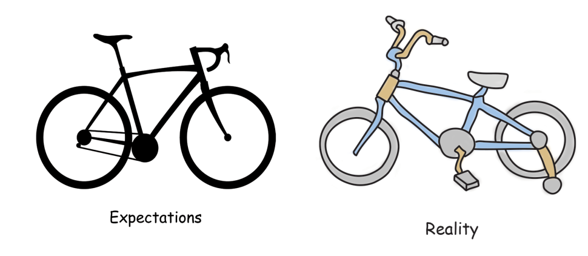
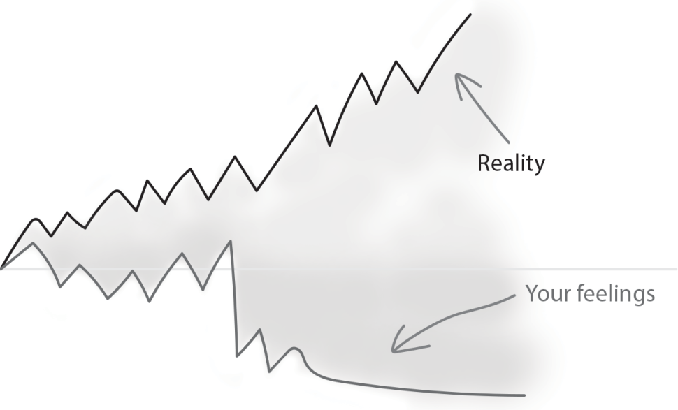
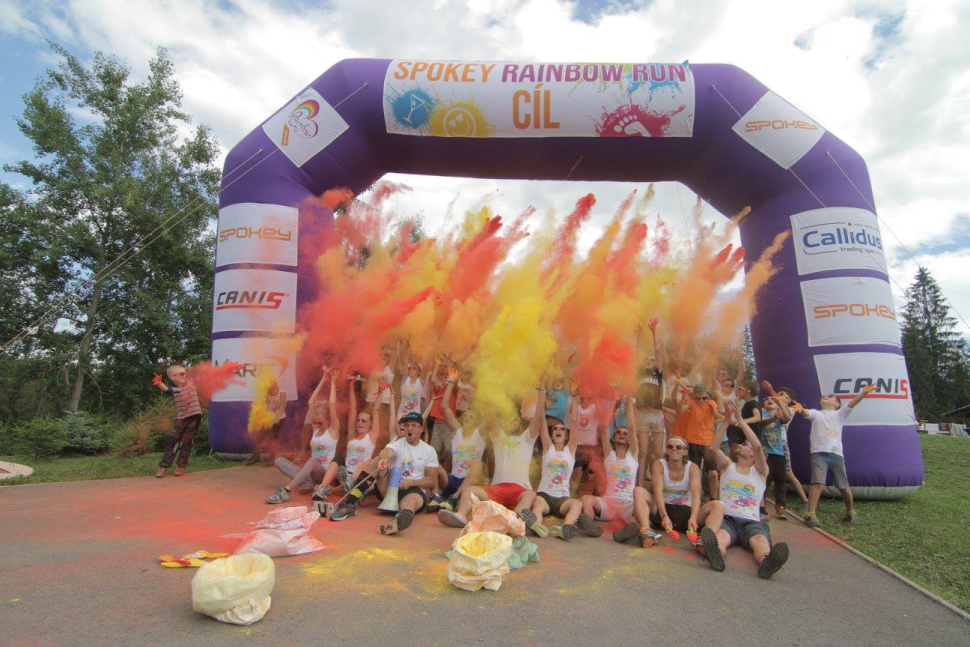

After 8 years of working for a children’s camp, we decided to sell the project. By overcoming numerous challenges I gained the know-how that I use for online products right now. I will speak about the camp, but imagine an online SaaS product instead of that. The principles are similar.

**About the project:**

The children’s camp, Kemp Snov, was a 7 days offline event where we had on average 50 children. During these 7 days we needed to take care of them. Day and night.

## How did our camp start?

I went skiing with my childhood friend. He started to talk about his new idea for building a camp for children. His previous experience with competitors was bad and he realized that he could create a much better experience for children. It is important to mention that he had domain knowledge. I joined the crew as a graphic designer. I had to create the camp identity and all the marketing materials needed. I will tell you a little secret; I had no idea how to do that.

To be honest, I was 19 years old and I just knew how to use Photoshop. I had no idea how to make a proper logo or other materials. But I loved challenges and somehow… I did it. Long story short, suddenly, I was not only creating graphic materials but started to help with the organization of the camp.

And from that point on, I have admired all people who build something from scratch, because there is a ton of invisible work they need to do.

## Our first paying customers:

It is important to mention that not only was I 19, but all of my team were the same age. Our budget was zilch and we were freshmen at university with zero experience building children camp brands. After months of experimenting, we got our first signup. We were dancing, singing and we felt that we won a championship. It was magical.

Why was it magical? We promoted something that was just in our heads. Our vision of the camp. We couldn’t use any photos of kids, because we didn’t have any. We had photos of empty rooms of the building we planned to go to. I used the same principle with [Bannerium - Photoshop plugin for generating ad banners and I got 400 signups. ](https://www.lunadio.com/blog/i-got-400-signups-with-a-video-of-a-product-that-didnt-exist)

We had gone through the “building a product” period, but now, we need to sell it. We had a program, vision, marketing materials, but we needed to fulfill the capacity. When you do an event, you need a target number. Why? Because you need to prepare everything for this event and you need to have a number in mind for how many attendees there will be. For us, it was 40 children. Which sounds doable.

Long story short, we didn’t make it. We called the parents and said that we couldn’t fill the capacity. It was awkward, embarrassing and it hurt. But people understood. In the first year, we had one children’s camp with 20 kids instead.

## Lessons learned from the starting period

### 💡 1. To start from scratch is harder than continuing with  what worked before.

To start is hard. Why? Everything was new. This was our first project, which makes it even harder. We needed to learn a little bit about marketing, sales, customer experience, user experience, etc. You think that you will create an amazing product, but the reality is different.

_First project will be cool as you expected to be._

### 💡 2. Be emotionally prepared that things will not go as planned.

There will be some downsides that just needed to be overcome. I’ve heard great advice from the Director of Product Management at Oracle, who told me that inexperienced people (like me!) can overreact to  some problems and make them bigger than  they actually are. Once you build more products, you can see these problems as little bumps on the road. They are not as catastrophic as you think. In reality, you are progressing even if you are failing. The only thing  to understand is why you failed and enhance that.

_Your feelings doesn&#39;t have to reflect the reality._

### 💡 3. See challenges as learning opportunities.

It is easy to say and hard to do. If we look at things this way, this gives us a lot of confidence in experimenting. We were not afraid to fail because we knew that we were still learning. Also, it was emotionally easier to overcome the downsides and some problems during the way.

## Let’s grow!

Once we overcame the first camp, we wanted to grow and took it a little seriously. I created a video from the camp, we had tons of photos and also got great feedback - from both the parents and the children. We knew we could build upon that.

We wanted to have 3 children’s camps with 30 kids in each. To reach that number we started to cooperate with some sales companies. Long story short - it didn’t work and they brought us 0 kids. And yes, it was frustrating.

Then we started to advertise the camp on discount portals. One of them bankrupted and we didn’t receive any money. But another brought us tens of people, but with one hook. These people got big discounts and they were more demanding than people who paid the full price. Some of them were hard to please and without a shadow of a doubt we tried everything. After this experience, we never advertised our camp on discount portals. Instead we gave discounts for loyalty.

After months of hustling, we got 60 kids, 3 rounds with 20 kids in each. To be honest, after those three weeks, we were quite exhausted. It even created some tensions between us - co-organizers. But we overcame them and thanks to that we now have better relationships.

## Lessons learned from the growth period

### 💡 4. Divide the responsibilities based on our interests and strengths

Crucial for us, in this turbulent period, was to divide the responsibilities based on our interests and strengths. Everybody did everything. This wasn’t scalable. On the other hand, we knew how to do  things and when anyone needed help, we just helped him/her. This was great because we could overcome problems together.

### 💡 5. We understood that we had 2 target audiences - users and customers.

The customers were the parents who had some motivation to put their children to camp. Then we had the users of the camp, who were children. Both of these groups needed to be treated differently. Parents need to be sure that their children would  be safe, that they would  not be hungry, bored or disinterested in  the program. Then the children just wanted to have fun and play with other kids. Communicating value to these groups is totally different. Your  customers and users who don't have to be the same person.

### 💡 6. We knew our limits.

It made us revisit what we wanted to achieve with the camp. Also, we realized it was harder to keep the quality when we had 3 weeks of children’s camps in the summer. And we weren’t satisfied with that.

## Let’s stabilize what we have

After the second hustling year we wanted to keep our quality from the previous year. We came back to one week per summer with more children in it. We realized that if we had a great time at the camp, children would  for sure have it too. Also, if we were nervous, the children would be too.

## Lessons learned from the stabilizing period

### 💡 7. Don’t spend too much time automating things, which you won’t need to automate.

We raised productivity with templates of automated responses, we also automated accounting, we could reuse parts of the program which worked well, etc. It was a big difference to build that 5th camp than the 1st one.

### 💡 8. Retrospectives are must-haves.

This helped us understand that we wanted to have one week per summer with more kids. And we didn’t want to have massive camps where the leaders didn’t even know the names of the kids. We still wanted to create an extraordinary experience for the kids, which was our “WHY” in the beginning.

### 💡 9. We learned what was working and we cut things which didn’t.

We stopped doing things, which had zero benefits to the camp. For example, Facebook advertisements worked well for us. We didn’t need to advertise anywhere else and lose our time/money. We knew which activities (features in online products) were received well by the  kids and which weren’t. We knew that because we were seeking feedback.

## The end period

Once we stabilized the camp and we knew what our standard was. We were still experimenting. We wanted to bring something new to the camp every time. For example - color run.

_Color run as a main attraction of the summer camp._

After 8 years we ended with 60 kids per camp. We had 2 branches of camps - Floorball Academy (a sports camp) and Kemp Snov (a mystery camp).

But once we got older we started losing focus. We were finishing up university, we had to find a job and priorities changed. Suddenly we didn’t have enough time to keep the quality of the Kemp Snov. And this can happen to any mature online product. Time changes people.We decided to sell our know-how and stepped out.

## Summary:

➡ Building your first product is hard. You need to learn, fail, learn, fail, and repeat. Failing is not a pleasant emotion. But this is how we improve ourselves.

➡ The First-year is hard because everything is new. Once you get used to it, you can automate a lot of things.

➡ Know your limits and what you want to achieve. It can lower the social pressure and expectations from others. You can clearly communicate what you want and don’t want to build.

➡ Know your “WHY” - Why did you start your product? Why do you get out of bed every day? - this  will help you overcome challenges and problems you will face with your product.

➡ Choose a product which you will love because it takes time to build something. We wanted to have an overnight success, but this is not how it works. Be patient.

➡ A huge plus is that if I need to prepare any kind of event, I have the basic know-how for  it. This is often the case.

Are you still hesitating to start your own project? Do it. I promise - you will learn invaluable things which can’t be taught in different ways.

If you are interested in more tips/tricks and stories about building products, join our newsletter!
