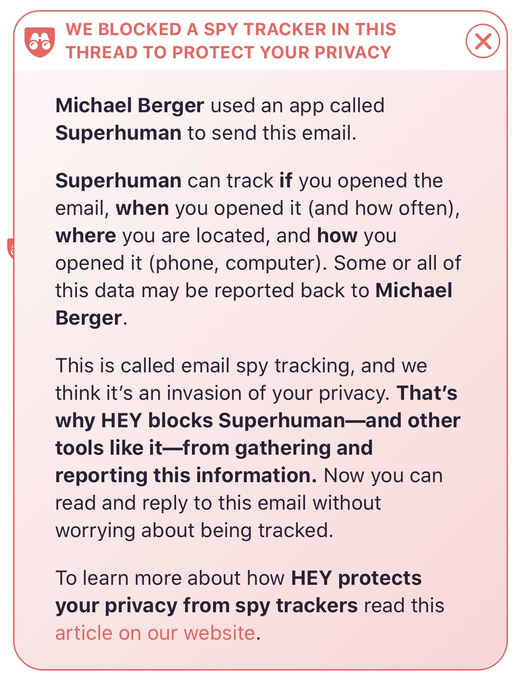

Why does every cool startup use Intercom despite its astronomical pricing? What makes Basecamp so unique? Have you heard about Roam Research recently?

## What is signaling?

Recently, I listened to [a podcast](https://medium.com/conversations-with-tyler/robin-hanson-tyler-cowen-signaling-the-elephant-in-the-brain-e1444b69baa7) with an economist Robin Hanson who (together with Kevin Simler) wrote a book **Elephant in the Brain**. They make two key arguments:

1.  Over 90% of our daily actions can be traced back to some kind of signaling
2.  We're not aware of this and subconsciously try to hide it from others

While it may seem that we're doing something for a specific reason, in reality, there's an underlying, selfish motive to increase our social status.

Signaling a way of communicating some value or opinion without explicitly talking about it.

A classic example is a luxury car. It can get you from point A to B and carry as much stuff as a regular car – but showing up in a Mercedes signals your economic power and thus your social standing.

We can see this behavior in many areas of our daily lives. Other than consumption, signaling heavily affects fields like charity or education.

And business software is not different.

Similar to conventional products, businesses buy software that:

- holds and expresses their values
- makes them look good in front of their customers
- attracts potential employees

This is not a new theory, but I think it's an interesting thought experiment to look at some software companies with that lens. Do customers prefer them based on the signaling potential?

## Intercom

People complain about Intercom's astronomical pricing all the time. There's plenty of high-quality and cheaper competing products, yet every cool startup picks Intercom. Even if they don't, they secretly want to. But why?

Intercom is a software equivalent to that Mercedes from the intro. It's widely known in the industry. People know it's expensive. If you're a growing SaaS company and use something else, it begs the question: Why don't you use Intercom?

It's the same as if a celebrity drove a Volkswagen. People would be confused. Why don't you drive a car that reflects your status?

I'm not arguing this is the sole reason people use Intercom. It's a great product and this wouldn't work if it wasn't.

Having that Intercom logo in the bottom right corner of your website signals your **economic power and your opinion on quality to your visitors**.

## Basecamp

Founders of Basecamp – DHH and Jason Fried – often talk about their views on business and ethics. Sometimes quite aggressively. They wrote multiple books about remote work and productivity. There's no doubt about their values as a company.

Basecamp clearly stands for a calm, organized, productive workplace.

It's cheaper, has fewer features, and works completely different than any other project management software. That's all intentional. The views and values of the founders are present in every part of Basecamp's interface.

Companies that identify with those values not only use Basecamp but actively talk about it. They want to signal "we're calm and productive workplace" to their potential employees.

Same as before, this wouldn't work if the product was bad or if the values were fake.

Their upcoming email service called Hey is infused with strong opinions against email tracking. Having a @hey.com email address will signal to everybody that you care about online privacy.

Also, Hey features detection and removal of email trackers with a big banner above the email body. I'm looking forward to all the tracker-shaming screenshots on Twitter.

[Source](https://twitter.com/dhh/status/1253400002291875840)

## Roam Research

If you've been on the tech side of Twitter lately, you know about this new note-taking tool. Roam allows you to link notes to each other and turn any word to a new page. Something you could already do in tools like Workflowy, Dynalist, or Notion.

There are some differences in features, but I'm more interested in the buzz Roam generated.

Roam launched roughly 6 months ago and is free to use until they figure out the pricing. Two weeks ago, they had to close down new signups to "improve stability and performance". During those two weeks, [35 000 people signed up on the waitlist](https://twitter.com/Conaw/status/1263895637675761666).

This wouldn't happen without an existing user base that constantly talks about the product.

The founders describe Roam Research as a "tool for networked thought". It's positioned as a note-taking tool for people whose work is highly intellectual. **Many people want to belong to that group (and signal to others that they do)**.

Roam users are [publishing guides on how to use it](https://nesslabs.com/roam-research-workflow-tips), [developing extensions](https://twitter.com/wirtzdan/status/1262464297579446273) to enhance its features, even giving each other "[MTV Cribs style tours](https://twitter.com/TheAnnaGat/status/1264172874304290816)" of their notes.

Also, there's a popular [#roamcult](https://twitter.com/hashtag/RoamCult) hashtag on Twitter. Do I need to say more?

## How to enable signaling with your product

Well, what a weird, but valid question. Unfortunately, this is not something you can implement like a new feature.

It may come naturally like in the case of Roam Research. Having a great product with a highly specific audience helps a lot. People naturally want to be a part of a group.

If you have a user-facing product like Intercom, try to find something that will improve how those users view your customers. Intercom gives its customers a status-boosting badge.

If you're making a product used internally, think about what it signals about the company to the employees.

Being useful is important, but having a higher meaning can set you apart from the competition.
