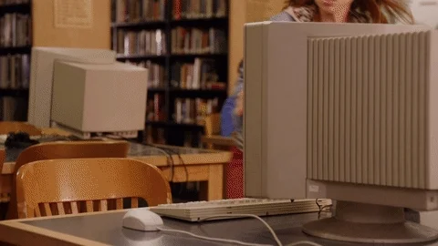
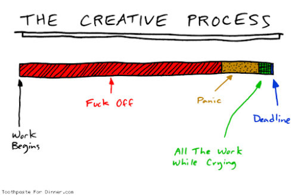

There is one thing you can’t buy. It’s time. Your time here is limited and you want to get the most out of it. It’s as simple as that. Time management is the art of organizing your time in order to be productive, healthy, and happy. And I’m calling it art because it’s not as simple as it looks. The world is noisy. You have tons of options so it’s hard to prioritize. You need a true commitment to see positive time management effects. You need to learn how to plan your working time but also think about mental health and positive thinking. It's important to know how to work with your flow and energy, too.

## Time management effects in real life

Today, I’m not going to talk about ‘how’. Let’s start with ‘why’. Why time management is important? I wasn't satisfied with my work ethics and work-life balance. I started to realize how important time management is. That's why I decided to work on my time management skills. I have read a few books and articles, I've seen a few videos, and I got better. Now, I would like to show you some benefits of organizing your time.

## End of procrastination

Procrastination is a time when you should do some planned work but you do other less important things instead of it. For example, watching funny videos of cats on YouTube instead of writing a blog post.

Take back the control of your time! I know, sometimes it's hard to focus on the job you really don't want to do but you have to do it. Managing your daily tasks will help you get more things done and enjoying cat’s videos too. The difference between procrastination and relaxation is simple. During procrastination, you are losing your positive energy, and you feel worse, in the end. When you take a break and relax, the volume of your positive energy is increasing. Therefore, don't forget to plan also time to relax in your daily schedule.

## More Family & friends time

With the right planning, you won't have to sacrifice time with people you care about. Think about it. You won't miss a football match with your son or a beer with your friends. Time is a commodity and I bet you want to enjoy as much of it as possible. Getting things done during business hours helps you to achieve that. If you successfully managing your time you can reach a balance between work and free time. Work-life balance is about finding a good ratio of these two elements. It helps you to get your life under control and tide up your priorities.

## Less stress time

One of the consequences of bad time management is stress. Many cases have shown how stress has a negative impact on our health. By better organization of your time, you can avoid the stress at all or at least decrease the volume of it. Your mind and body will thank you.

## Time is money

I bet you heard that before. Everyone has a price. Mostly, it’s a salary. You exchange your time for money. You are being pushed (or you push others) to perform some job that takes your time. If you are able to plan your time effectively, you can earn more in less time. This time management effect is awesome 🤑.

## Positive mood

Did you ever feel satisfied after finishing the whole to-do list? By applying principles of time management, you can feel it every day. You can also feel happy about spending less time on each task and move faster towards your goals. At the end of the day, you will have more time for your hobbies, family, and friends.

## Better prioritization

Some tasks have more importance than others. Planning your job helps you to set priorities and deliver better results. You can learn how to value your time and get more things done. The other benefit linked to prioritization is an easier decision making. If you are able to set the priorities it’s easier to decide what to do and what not to do. You can save time and keep your flow by simply ignoring things that don’t match your plan.

## Improving your level of self-discipline

Self-discipline is building the baseline that allows you to act in accordance with your longterm goals no matter how motivated you feel. Once you have made a choice you will encounter personal pressure to behave consistently with that commitment. You can quickly improve your self-discipline by forming good habits. They are like a cheat code to productivity. Focus on one habit at a time so you don't get overwhelmed.

## Avoiding burnout

Burnout is a state of emotional, physical, and mental exhaustion. It doesn’t appear overnight. It’s caused by ignoring job stress for a longer time. The symptoms you might notice could be poor performance, reduced creativity, and exhaustion in work. You can avoid stressful deadlines by finding harmony in your time schedule. You will handle unexpected events better, and limit the amount of daily stress to zero.

## Efficiency vs effectivity

To be efficient is to use the fewest resources for the given task. It means that you are able to perform a job in less time.

Effectiveness is the function of goal accomplishment (either you achieve your goal or you don’t). It’s about doing the right tasks regardless of the time and resources used for it. When you manage time effectively rather than efficiently, you become more productive and get more of the right work done.

## Increase in productivity

Selecting important tasks you want to accomplish can help you be more productive. Do you know the 80/20 rule? Only 20 percent of what you do each day produces 80 percent of your results. Productivity is not just about doing as many tasks as possible. It’s about accomplishing the things that matter.

## Summary

Time management is a skill you can learn. It's not about talent or precondition. You can start anytime and built habits that help you get a better life. Trust me, it's worth it. People work about ⅓ of their lives. Get good outcomes by following simple time management principles.

**Check these sources if you want to achieve good time management effects.**

Videos by [Thomas Frank](https://www.youtube.com/channel/UCG-KntY7aVnIGXYEBQvmBAQ).

[Getting things done](https://gettingthingsdone.com/) by David Allen.

[The end of procrastination](https://procrastination.com/) by Petr Ludwig.
