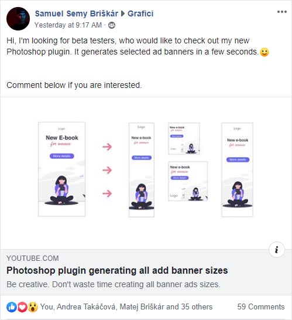

Let’s say you have a [business idea](https://www.lunadio.com/blog/how-to-come-up-with-a-million-dollar-startup-idea). Now, you want to validate your idea and find out if it is worth doing. How to do it low-cost with no programming skills and no marketing costs?

When I was running a dev company, many people came to me asking to build a product they didn’t know is going to work. Of course, they wanted to do it with a tiny budget because they didn’t want to invest too much into something that could fail.

I always tried to understand their business and guide them on how to validate the idea before investing tens of thousands of dollars into development. I advised them to spend time talking to people and get feedback rather than building a product **they think will just work**. Honestly, I have worked on maybe 100 projects, but the majority of them didn’t go as planned. You always need to change or update something based on customer feedback.

In this blog post, I will show you four great examples of how you can validate your idea with no money.

## No code marketplace

Let’s start with my recent favorite app called [Nesnězeno](https://nesnezeno.cz/). It is a mobile platform where restaurants can offer their unsold food for lower prices. It helps to reduce food waste, customers enjoy tasty food and save money at the same time. This app has saved 33 thousand meals already, and it operates only less than a year!

It may seem like you need a lot of money to build a project like that. Brand design, native mobile apps for Android and iOS, a web interface for restaurants, web administration, etc. On top of that, it is a marketplace that is very hard to launch because you need both restaurants and customers at the same time. It wouldn’t work if you had restaurants, but no customers and customers won’t use it if there were no restaurants.

How to start a project like this with absolutely no development costs at all? Any ideas?

**A Facebook page.**

This was a brilliant idea. The founders created a simple Facebook page where restaurants could offer unsold food. People only needed to add a comment on the post and secure portion of a meal for themselves. They gave admin permissions to each restaurant, so they didn’t have to manage anything. The restaurant just took a photo of a meal and created a new Facebook post. They managed to create a working business using only a Facebook page. Restaurants sold hundreds of meals per week this way.

It worked so well because of a few things.

1. **Enormous organic reach**: When people wanted the meal, they needed to make a reservation by adding a comment on that post. Often, they liked the post too. That led to enormous organic reach because every post had tens of comments and likes. People were very active on the page, and the Facebook algorithm loves that.

2. **Simple restaurant management**: It was simple to set up a new restaurant. They only needed to give admin permission to one restaurant employee. No bureaucracy, no paperwork, no invoices, no guidelines on how to use the system. It was so simple and so clever in the right way. Everybody knows how to use Facebook, and people are already using Facebook. They didn’t have to create a new platform, a new marketplace.
3. **Building a community**: Facebook is an optimal place when you want to build a community. Community is a key factor in this project (and in many others too). They presented a social impact idea of not wasting food and successfully built a community around it. Media and the public support it all the way.
4. **Low marketing costs**: They didn’t need to spend a lot on marketing because they had high organic reach. But when they invested some money, it paid off really well. Marketing costs were low because they promoted a Facebook page, not an external website. The Facebook page went viral, and business was growing really fast.

After a while, they raised money and built the whole product on the foundation of this Facebook page. Many competitors were rising at the same time, but they ended up on the top because both restaurants and people stayed loyal to the project and the brand.

## Fake it until you make it

The next great example of idea validation is linked to one of our products. I am talking about [Bannerium](https://bannerium.com/), which is a photoshop plugin to help you generate ad campaigns.

There are not that many people who use photoshop plugins, but it still has a significant user base. Creating a Photoshop plugin as a SaaS is not trivial, and it takes a lot of time. Especially for [Samuel](https://twitter.com/SamuelBriskar), who had no experience with plugin development whatsoever. We needed to find a way how to validate this idea before spending weeks or months on development.

Do you know the [Dropbox story](https://techcrunch.com/2011/10/19/dropbox-minimal-viable-product/)? Drew Houston, the founder of Dropbox, wanted to create cloud storage that just works. He believed that if the software “just worked like magic,” customers would flock to it. He was trying to raise money for his idea, but he wasn’t successful. He needed a way to show investors that it is a great idea, and people want it. But he couldn’t build a product because that would take months and cost millions of dollars.

**He decided to create a** [**video**](https://www.youtube.com/watch?v=7QmCUDHpNzE&feature=emb_title)**.** In this video, he demonstrated how the product works, and people could just sign up for the beta version. It went viral, gaining over 75k subscriptions overnight. He successfully validated the product and was able to raise money.

Luckily, Samuel has a background in video production. He did the same. He created a [video](https://www.youtube.com/watch?v=JWApMjQ3-jE) of using the Photoshop plugin and put it on a simple landing page with a sign-up form. He shared the video on Facebook groups focused on ads and design.

The subscription list has grown quickly, and hundreds of people are waiting for this product right now. Even big companies start to show up because they calculated how much time their employees can save using this plugin. It’s finally time to focus on development and bring this project to life.

## Creating a buzz

I would describe this technique as “**marketing before product**”. Think about marketing from day one. Even before starting building something, try to sell it to someone. You can create a perfect product with desired features, but if you can’t sell it, you probably won’t be successful.

Another excellent example of how to validate your idea is creating a buzz. In this case, I will talk about a [startup](https://case-crunch.com/) that wants to bring innovations to the law business. Their target groups are big law companies and top consulting firms like Deloitte, Ernst & Young, KPMG, and PwC. In short, these companies don’t usually deal with small startups. The million-dollar question is how to convince them to try your product.

They organized an event. One hundred top lawyers from London were invited to compete against AI. Both the humans and the AI were given the basic facts about various cases, and they were asked to predict the verdict. They focused only on one kind of case for which they trained the system. From 775 predictions, the computer was right with 86% accuracy, compared with 66% for the lawyers.

You might read about articles saying AI will replace jobs like taxi drivers, bakers or couriers... but lawyers?! The next day, all top law and consulting companies were talking about it. And not only them. Even BBC wrote [an article](https://www.bbc.com/news/technology-41829534) about it, and then, of course, other media picked the story up as well.

Suddenly, they didn’t have a problem to arrange a meeting with anyone. Companies were practically begging to try the product. It was a clear sign they are good to go and can start building the product.

## Validate an idea with a simple landing page

The last example I would like to bring up is a landing page. You don’t need much. Just a one-page landing page with a contact form. That’s it. It is enough for you to present your project online and validate the idea. **I created 3 landing pages for 3 different products before I decided to work on** [**interactive presentations**](https://www.prezelive.com/)**.** I didn’t spend much time doing that I just want to present the idea to others, and this is the most convenient way how to do it.

One day a random guy shows up in our offices with a startup idea. He wanted to create an app that connects cafes with coffee lovers. He said cafes would offer a lower price for a coffee in exchange for a wave of regular customers. He wanted to build a platform, a mobile app that would take weeks to develop.

I proposed we create a simple one-page landing page with the idea description and sign up form. If he manages to convince at least 20 cafes in the city and at least 100 people will sign up for a product, we will build that system for him. He agreed. We made a landing page, and he talked to cafes around the city asking for feedback. Meanwhile, customers were signing up. Coffee lovers are not hard to find. You just need an Instagram account and find a few popular hashtags. Marketing costs were almost zero.

It took less than a month to accomplish this task, and that was a sign for us to create this product. That’s how [DejKafe](https://dejkafe.cz/) (GetCoffee) was born.

As I already mentioned, **I strongly believe in the power of a simple landing page**. I use this technique in all of my projects.

In the following blog post, I will write about how to create a perfect and effective landing page. I will present some no-code platforms and some great template sources for those who can code. [**Subscribe**](https://www.lunadio.com/subscribe/) **to our newsletter and don’t miss the next article.**
