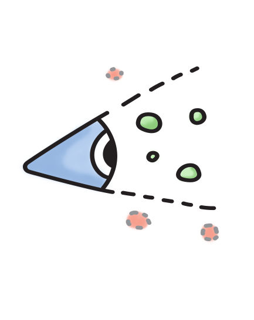
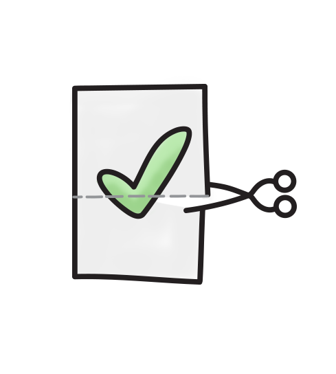
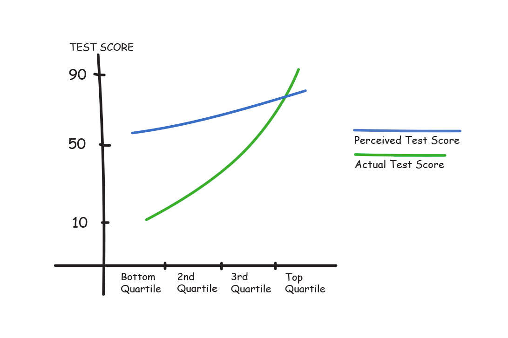

In my [previous blog post](https://www.lunadio.com/blog/4-cognitive-bias-examples-you-should-be-aware-of-as-a-designer), I wrote about the fact that we fall in love with solutions which we built. Just because we built it. In this article, I would like to focus on irrational decisions. I want to introduce you 3 cognitive biases, which can help you make better decisions.

## 1\. What you see is all there is (WYSIATI)

_What you see is all there is psychological effect named by Daniel Kahneman_

As Daniel Kahneman, father of behavioural economics, says; “If we see some elements of the story, we construct the best possible story out of these elements.” \[1\] He also mentions that we do not tend to look for elements which we don’t see.

We can categorize things into four buckets:

1.  things which we know (see)
2.  things which we don’t know (don’t see)
3.  things which we don’t know, that we don’t know.
4.  or things which we don’t know that we know \[2\]

To make this clear, let's focus on the first 2 categories.

> If you have bad requirements, you will do just as bad designs.

### Where WYSIATI can be problematic

- Imagine your product manager/client/customer comes to you and gives you a task. If you just take their requirements and design based on them, you are exposed to WYSIATI and can make irrational decisions. Do not be afraid to ask basic questions, like: “From which sources did you get these requirements?” or even “How many people did you have a chance to speak to?” “Was the requirement from a colleague, user, or is some CEO just pushing for this?” With these questions, you want to understand what is the story behind the specific requirements to avoid making irrational decisions. These questions can help you understand things which you hadn’t previously. There are always things which we don’t know. If you have bad requirements, you will do just as bad designs.
- How many times have you heard from your friend: “I have a great [business idea](https://www.lunadio.com/blog/how-to-come-up-with-a-million-dollar-startup-idea) which will be used by thousands of people.” To be honest, I was one of them. I've done lot of irrational decisions. Most of the time, I jumped quickly to a solution but I didn’t focus on things which I didn’t know. I did not [validate the idea](https://www.lunadio.com/blog/validate-your-idea-with-pocket-money) properly. I didn’t have data from the market. I created a story, based on what I had heard. It was enough to run SEO keywords to at least get some idea about the market. The most painful thing is to start building something where there is no market and nobody needs your solution. I wish I had known that.

Daniel Kahneman also mentions a few other things which are good to know:

- As Maria says; “The confidence people have in their beliefs is not a measure of the quality of evidence \[but\] of the coherence of the story that the mind has managed to construct”. \[3\]
- Life is more complicated than we think it is. \[4\]
- Once we have a story based on some facts, we tend to ignore factors which don’t fit. This lead us confirmation bias. \[5\]

## 2\. Confirmation bias

_Confirmation is type of cognitive bias, which is hard to overcome._

Once we are aware of WYSIATI and are trying to get more data from different sources, be aware of confirmation bias. As Shahram Hehmant Ph.D. notes: “When people would like a certain idea or concept to be true, they end up believing it to be true.” Moreover, as I mentioned in the previous part, once we have formed a view, we do not take into account information that does not confirm our belief. On the other hand, we ignore or even reject information which puts it into question. \[6\]

When confirmation bias can be problematic?

Gary Klein, from Psychology Today, points out the problematic parts of confirmation bias:”

- **Search**: search only for confirming evidence (Wason’s original definition)
- **Preference**: prefer evidence that supports our beliefs
- **Recall**: it is best remember information in keeping with our beliefs
- **Interpretation**: don’t just interpret evidence in a way that supports our beliefs
- **Framing**: don’t use mistaken beliefs to misunderstand what is happening in a situation
- **Testing**: don’t ignore opportunities to test our beliefs
- **Discarding**: don’t explain away data that don’t fit with our beliefs” \[7\]

### How to overcome confirmation bias?

- There are some methods like Six thinking hats by Edward de Bono, which help you to think about a problem from different perspectives, such as; facts, emotion, benefits, ideas, planning, judgement. \[8\]
- I also believe everybody has some friend who likes to question everything. Introduce him/her to your solutions, but be emotionally prepared for their criticism.

### How can you leverage confirmation bias?

- Have you noticed clients’ logos on designers’ or agencies’ portfolios? Clients who are browsing different portfolios are trying to find out who will match their needs the best. They want to do a task and try to find out if they can trust you as a designer. Client logos, testimonials and successful projects are answering this basic question. Can I trust this person? \[9\]
- One great way to leverage confirmation bias is to use product users’ language. Have you ever noticed that you like to speak with people who are from your field? Among designers there are lots of magic words. Once somebody says them, you know the person is part of the ‘in’ crowd. We can use these words in our product pages. Its a way of saying we have shared interests.

We know about WYSIATI and confirmation bias. Still we can overrate ourselves, our products and do irrational decisions. The Dunning-Kruger effect can help ground us.

## 3\. Dunning-Kruger effect

_Dunning-Kruger effect can effect all of us in different domains._

Have you ever had a feeling that you are great at something when you were not? That your product is far better than your competitor’s? Well, probably you experienced the Dunning-Kruger effect. People wrongfully overestimate their knowledge or ability in specific domain. \[10\] This is one of these cognitive biases which are hard for us to spot ourselves. But, it is easy to see other people’s blindspots.

Let's see the graph below which shows us nicely Dunning-Kruger effect.

_Graph on the picture is effectively showing us Dunning-Kruger effect._

Students who did score below 70 overestimate their ability. More incompetent they were, bigger overestimation they did. On the other hand, students over 70, underestimate their score. They expected others to be on the same level as they are. \[11\] \[12\]

The fact is, that everybody of us can do irrational decisions. Once we are expert in domain, we are aware of things which we don't know. But if we switch domain, we can easily be exposed this effect even more.

### When Dunning- Kruger effect can be problematic?

- As a designer, I have worked on a lot of projects. When I retrospectively look at them, I can easily spot some mistakes. The question like; “Oh god, how could I. What irrational decisions did I do?” is often in my head when I review past decisions. I believe I was stubborn and some people knew I could do better.
- Have you noticed startups which don’t solve anything because they don’t understand the problem? If you give the owners feedback, based on data, often they just don’t listen. It can easily happen if there is no-one who understands the business’ needs regarding the product. This can happen when we want to step into the market which we totally don’t understand. It is easy to jump from one idea, from one domain, to totally different idea or domain. But be prepare to do lots of irrational decisions.
- The only way how to battle Dunning-Kruger effect is by raising the knowledge of concerned person. \[11\] The problem is, that all of us can be affected by this effect as I mentioned in previous text.

### Summary of this blog about irrational decisions:

At the end of the day, we can be confident about things which are false or even crap. We can fight and argue with our friends/colleagues/managers about them. But many times, we can be just biased and missing some information. As Mike Monteiro mentions: “when client (user) is giving you feedback, this is a great time to keep your mouth shut. Just listen.” \[13\]

I plan to write more about cognitive bias examples in design or product management. Feel free to join our newsletter and don't miss any blogspot.

### Sources:

\[1\] Idea Lab, Inc. (Youtube). Eric Shurenberg and Daniel Kahneman, Interview. Link: [WYSIATI](https://www.youtube.com/watch?v=R6ArpK5HOzU)

\[2\] CNN (Youtube). Rumsfeld. Link: [RUMSFELD / KNOWNS](https://www.youtube.com/watch?v=REWeBzGuzCc)

\[3\] Brain Pickings. Maria Popova: How Our Minds Mislead Us: The Marvels and Flaws of Our Intuition. Link: [https://www.brainpickings.org/2013/10/30/daniel-kahneman-intuition/](https://www.brainpickings.org/2013/10/30/daniel-kahneman-intuition/)

\[4\] Froneiras do Pensamento (Youtube). Daniel Kahneman – Entrevista Exclusiva. Link: [https://www.youtube.com/watch?v=h3xr3VTpEx0](https://www.youtube.com/watch?v=h3xr3VTpEx0&list=PLmoBgIJT1EIwcNGzGgZyEVZMu3fXB4XAk&index=154)

\[5\] Thinking Fast and Slow by Daniel Kahneman. Link: [https://amzn.to/2QUKrec](https://amzn.to/2QUKrec)

\[6\] Psychology Today, What Is Confirmation Bias? Shahram Heshmat Ph.D. Link: [https://www.psychologytoday.com/us/blog/science-choice/201504/what-is-confirmation-bias](https://www.psychologytoday.com/us/blog/science-choice/201504/what-is-confirmation-bias)

\[7\] Psychology Today, The Curious Case of Confirmation Bias. Gary Klein Ph.D. Link: [https://www.psychologytoday.com/us/blog/seeing-what-others-dont/201905/the-curious-case-confirmation-bias](https://www.psychologytoday.com/us/blog/seeing-what-others-dont/201905/the-curious-case-confirmation-bias)

\[8\] Mindtools, Six Thinking Hats. [https://www.mindtools.com/pages/article/newTED_07.htm](https://www.mindtools.com/pages/article/newTED_07.htm)

\[9\] Venture Harbour, The Confirmation Bias: 7 Ways to Use It to Boost Your Conversions (with Examples). Link: [https://www.ventureharbour.com/the-confirmation-bias-7-ways-to-use-it-to-boost-your-conversions-with-examples/](https://www.ventureharbour.com/the-confirmation-bias-7-ways-to-use-it-to-boost-your-conversions-with-examples/)

\[10\] Psychology Today, Dunning-Kruger Effect. Link: [https://www.psychologytoday.com/us/basics/dunning-kruger-effect](https://www.psychologytoday.com/us/basics/dunning-kruger-effect)

\[11\] Procrastionation.com (Youtube), #04 The greatest problem of today's world: Dunning-Kruger effect. [https://www.youtube.com/watch?time_continue=140&v=VyipktSZUlQ&feature=emb_title](https://www.youtube.com/watch?time_continue=140&v=VyipktSZUlQ&feature=emb_title)

\[12\] Neurologica Blog. Misunderstanding Dunning-Kruger. Steven Novella. Link: [https://theness.com/neurologicablog/index.php/misunderstanding-dunning-kruger/](https://theness.com/neurologicablog/index.php/misunderstanding-dunning-kruger/)

\[13\] Creative Blog (Youtube), 13 Ways Designers Screw Up Client Presentations. Mike Monteiro. [https://www.youtube.com/watch?v=IXXKqwrEql4](https://www.youtube.com/watch?v=IXXKqwrEql4)

I am currently helping with a project called [Bannerium](https://www.bannerium.com/). If you still spend time creating banner campaigns manually, it's made for you.
